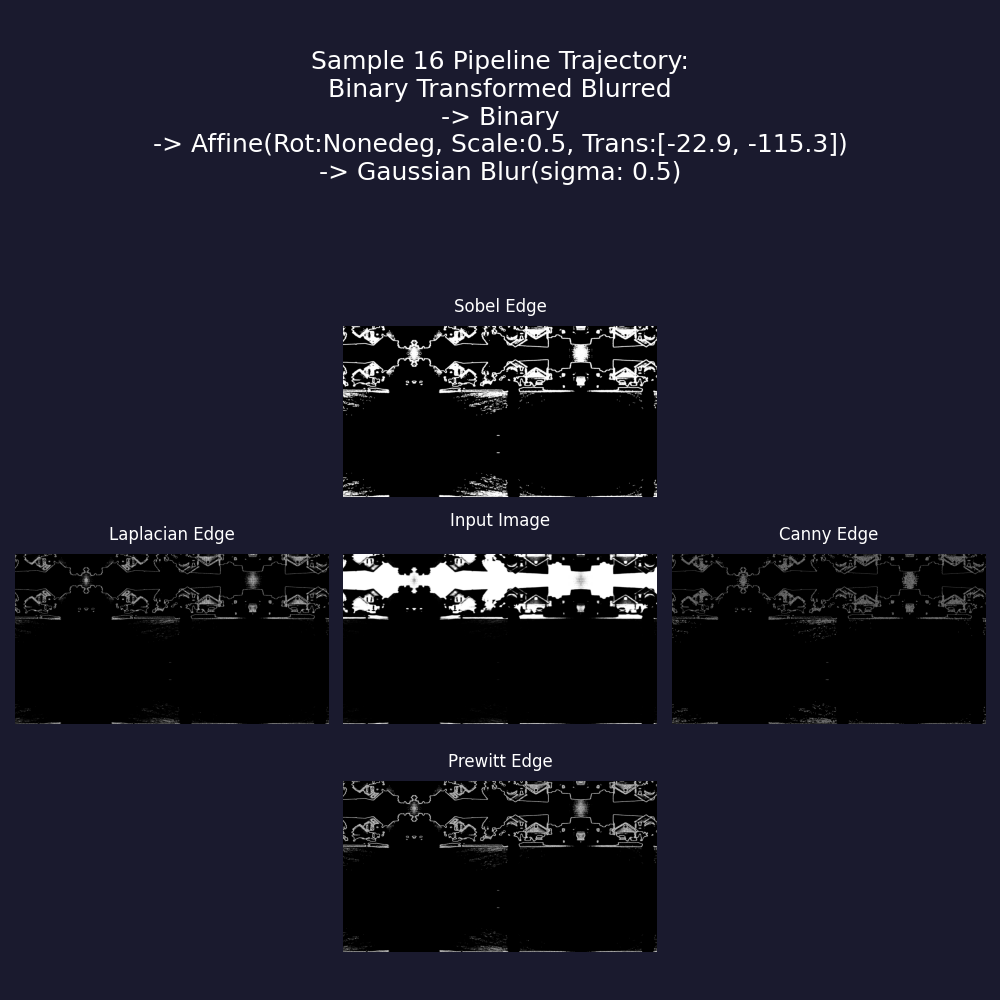
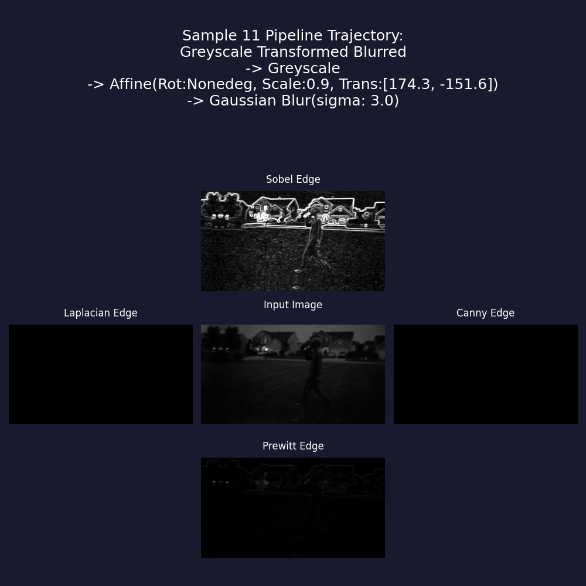
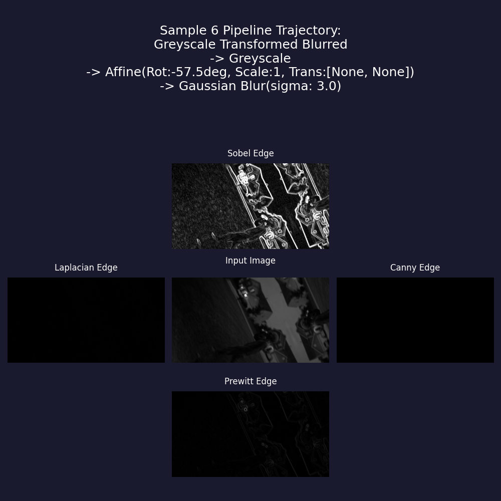
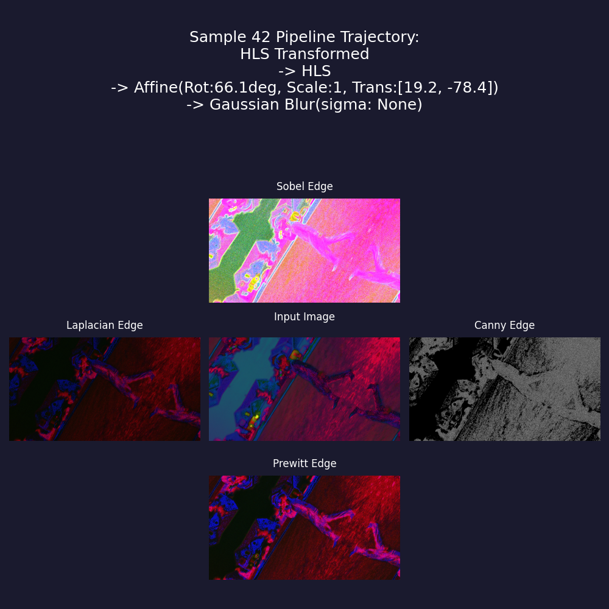
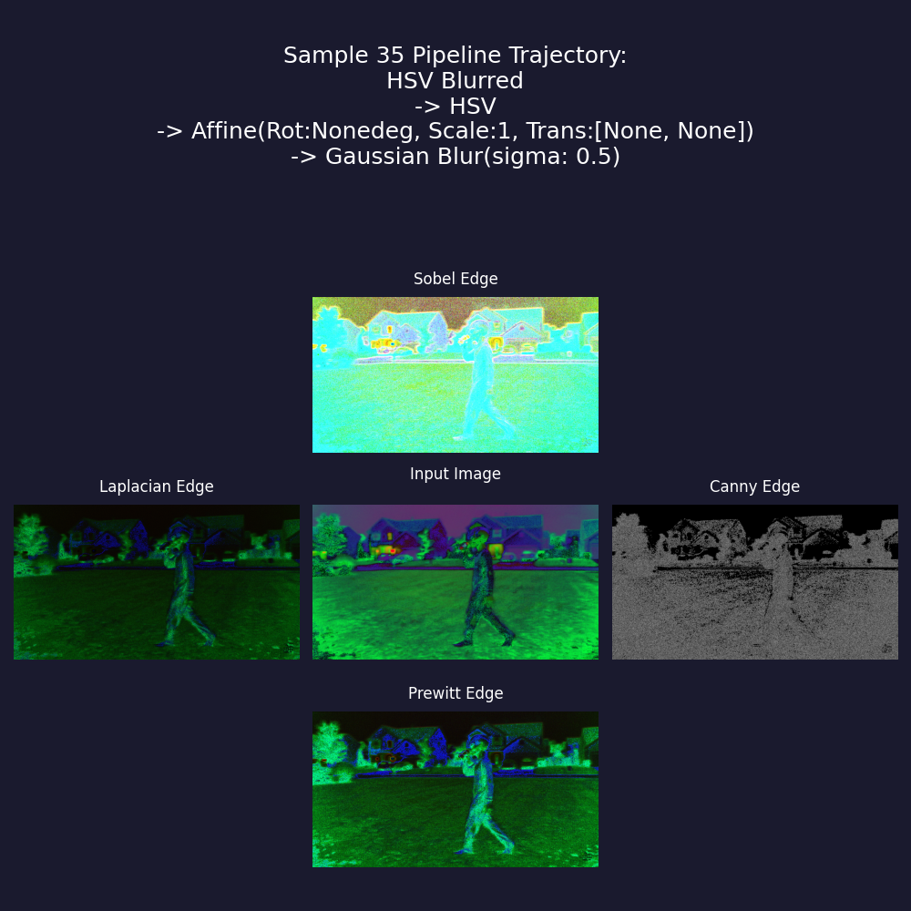
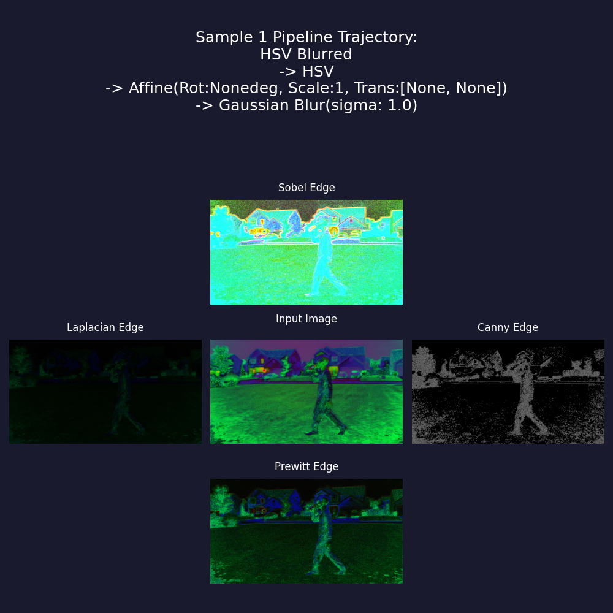

# JenniferIsobe-CS898BA-Project1

This repository was completed as part of CS898BA and serves as an introduction to image analysis and processing using Python and OpenCV.

The AI_LOG directory provides a history of interactions with AI that were used as part of the development of this repo.

Files contained in the result_analysis directory are the files that were used for the discussions below.

## Running the program

Open a terminal and clone to repository to your local machine: `git clone`

Change directories into the project: `cd JenniferIsobe-CS898BA-Project1`

Run the following in the terminal while in the project directory to run the script: `uv run script.py`
Run the following in the terminal while in the project directory to run the script and write the terminal output to a file: `uv run script.py > output.txt`

***Note: Re-running the program will override the files in the results directory. If you want to save those files, rename the results directory***

## 2.8 Gaussian Blur discussion

TODO: Add gaussian blur discussion from 2.8 to README

On some of the images, like the original and cielab it is a bit difficult to determine the effect of the blur on the image visually. The original is pretty uniformly dark and and cielab is uniformly yellowish and the blurring effect does not stand out as much. The greyscale image is also difficult to see the effect on but is more apparent than the original and cielab. Overall, the best sigma level seems to be between levels 1.5 and 2.0.

Sigma 0.5: This has very little effect on the blurring and noise reduction when compared to the pre blurred image
Sigma 1.0: Provides a slightly more blurred image but still has very little effect
Sigma 1.5: This is where the noise reduction becomes more noticeable, for most of the images. The noise of images are reduced but it is not overly blurred where the edges are lost
Sigma 2.0: This sigma level also has a very good balance between noise reduction and edge clarity retention.
Sigma 2.5: At this point, the images start to become more blurry than clear reducing the usefulness of the blurring.
Sigma 3.0: The images' edges are ver softened at this level and while I don't think edge detection would not be impossible, it would be more difficult.
Sigma 3.5: At this sigma level, all of the images become overly blurry resulting in the loss of edges on the image.

## 3.5 Edge Detection discussion

TODO: Add 3.5 discussion to README: Discuss the pros and cons of each edge detection technique and perform an analysis of which of these techniques works best for this image set.
Reminder – Canny may be the most used and applied, but it may not be the best in your case. Make sure your analysis fits your results

for clielab, original, and grey: Sobel is the best, the rest are basically black

## Plots

### Plot 1

### Plot 2

### Plot 3

### Plot 4

### Plot 5

### Plot 6

