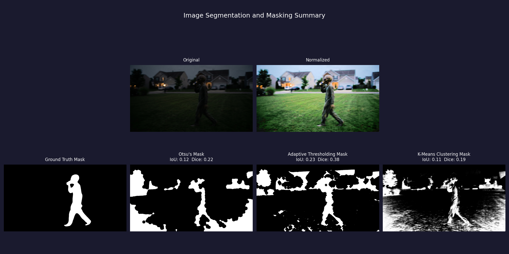
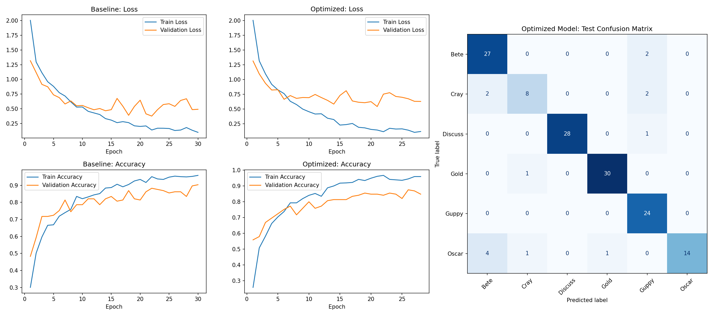

# JenniferIsobe-CS898BA-Project1

## Table of Contents

- [JenniferIsobe-CS898BA-Project1](#jenniferisobe-cs898ba-project1)
  - [Table of Contents](#table-of-contents)
  - [Homework 1](#homework-1)
    - [Code Explanation](#code-explanation)
      - [Dependencies](#dependencies)
      - [Configuration \& Setup](#configuration--setup)
      - [Helper Functions](#helper-functions)
        - [`file_hash(path)`](#file_hashpath)
        - [`write_file(path, img)`](#write_filepath-img)
        - [`count_files(path)`](#count_filespath)
        - [`to_rgb_display(img)`](#to_rgb_displayimg)
      - [Part 2: Basic Analysis](#part-2-basic-analysis)
        - [Step 1: Per-Channel Statistics](#step-1-per-channel-statistics)
        - [Step 2: Color Space Conversions](#step-2-color-space-conversions)
        - [Step 3 \& 4: HSV Normalization](#step-3--4-hsv-normalization)
        - [Step 6: Affine Transformations](#step-6-affine-transformations)
        - [Step 8: Gaussian Blur](#step-8-gaussian-blur)
      - [Part 3: Edge Detection](#part-3-edge-detection)
        - [Step 1 \& 2: Image Subsets](#step-1--2-image-subsets)
        - [Step 4: Edge Detection Techniques](#step-4-edge-detection-techniques)
        - [Step 7: Comparison Plots](#step-7-comparison-plots)
    - [Running the program](#running-the-program)
    - [2.8 Gaussian Blur discussion](#28-gaussian-blur-discussion)
    - [3.5 Edge Detection discussion](#35-edge-detection-discussion)
    - [Plots](#plots)
      - [Plot 1](#plot-1)
      - [Plot 2](#plot-2)
      - [Plot 3](#plot-3)
      - [Plot 4](#plot-4)
      - [Plot 5](#plot-5)
      - [Plot 6](#plot-6)
  - [Homework 2](#homework-2)
    - [HW2 Code Explanation](#hw2-code-explanation)
      - [HW2 Dependencies](#hw2-dependencies)
      - [HW2 Setup and Configuration](#hw2-setup-and-configuration)
      - [Part 2](#part-2)
      - [Part 3](#part-3)
        - [Otsu's Thresholding](#otsus-thresholding)
        - [Adaptive Thresholding](#adaptive-thresholding)
      - [Part 4](#part-4)
        - [K-Means Clustering](#k-means-clustering)
        - [Cluster Testing](#cluster-testing)
        - [Foreground Extraction](#foreground-extraction)
      - [Part 5](#part-5)
        - [Metric Calculation](#metric-calculation)
        - [Plot Creation](#plot-creation)
      - [Running HW2 Script](#running-hw2-script)
    - [Qualitative Analysis](#qualitative-analysis)
    - [Quantitative Comparison](#quantitative-comparison)
      - [Summary](#summary)
      - [Gaussian Blur](#gaussian-blur)
      - [Otsu's Mask Cleaning/Smoothing](#otsus-mask-cleaningsmoothing)
      - [Otsu's MORPH\_CLOSE iterations](#otsus-morph_close-iterations)
      - [Adaptive Thresholding Block Size](#adaptive-thresholding-block-size)
      - [Adaptive Thresholding C value](#adaptive-thresholding-c-value)
      - [Adaptive Thresholding Mask Cleaning](#adaptive-thresholding-mask-cleaning)
      - [Adaptive Thresholding MORPH\_CLOSE iterations](#adaptive-thresholding-morph_close-iterations)
      - [K-Means Iterations and Epsilon](#k-means-iterations-and-epsilon)
      - [K-Means Clusters](#k-means-clusters)
    - [HW2 Plot](#hw2-plot)
  - [Homework 3](#homework-3)
    - [HW3 Code Explanation](#hw3-code-explanation)
      - [model.py](#modelpy)
      - [preprocess.py](#preprocesspy)
      - [train.py](#trainpy)
      - [test\_hyperparameters.py](#test_hyperparameterspy)
      - [evaluate.py](#evaluatepy)
      - [Running HW3 Script](#running-hw3-script)
    - [HW3 Qualitative Analysis](#hw3-qualitative-analysis)
    - [HW3 Quantitative Comparison](#hw3-quantitative-comparison)
      - [Hyperparameter Tuning Results](#hyperparameter-tuning-results)
    - [Effect of Learning Rate](#effect-of-learning-rate)
    - [Effect of Dropout](#effect-of-dropout)
    - [Effect of Batch Size](#effect-of-batch-size)
    - [Effect of Weight Decay](#effect-of-weight-decay)
    - [Baseline Model — Classification Report](#baseline-model--classification-report)
    - [Optimized Model — Classification Report](#optimized-model--classification-report)
    - [Baseline vs. Optimized — Comparison](#baseline-vs-optimized--comparison)
    - [HW3 Plots](#hw3-plots)

This repository was completed as part of CS898BA and serves as an introduction to image analysis and processing using Python and OpenCV.

The AI_LOG directory provides a history of interactions with AI that were used as part of the development of this repo.

## Homework 1

Files contained in the result_analysis directory are the files that were used for the discussions below. This directory contains subdirectories for parts 2 and 3 with part 3 contain additional subdirectories for the plots.

script.py contains the logic for the image analysis of the given original.png file. (***Please note, this will not work if original.png is not in the project root***)

### Code Explanation

#### Dependencies

```python
import numpy as np # Array operations and additional computation
import cv2 as cv # OpenCV — image read and write, processing, edge detection
from pathlib import Path # Cross-platform file path handling
import hashlib  # MD5 hashing for cache invalidation
from scipy import stats # Skewness calculation for channel statistics
import random # Reproducible random transforms and subset selection
import matplotlib.pyplot as plt  # Generating comparison plot figures
```

#### Configuration & Setup

```python
SEED = 42
random.seed(SEED)
```

The fixed random seed ensures that every run produces the same results for reproducibility. Change `SEED` to any other integer to get a different random outcome while keeping it reproducible.

```python
RESULTS_DIR = CURRENT_DIR / "results"
PART2_DIR   = RESULTS_DIR / "part2"
PART3_DIR   = RESULTS_DIR / "part3"
PLOTS_DIR   = PART3_DIR / "plots"
README_PLOTS_DIR = PART3_DIR / "readme_plots"
CACHE_DIR   = CURRENT_DIR / ".cache"
```

All output directories are defined as `Path` objects and created with `mkdir(exist_ok=True)`, which means the script can be rerun without manually clearing folders beforehand.

#### Helper Functions

##### `file_hash(path)`

```python
def file_hash(path):
    with open(path, "rb") as file:
        return hashlib.md5(file.read()).hexdigest()
```

Generates an MD5 hash of a file which is used to build cache filenames.

##### `write_file(path, img)`

```python
def write_file(path, img):
    cv.imwrite(path, img)
```

A thin wrapper around `cv.imwrite` that keeps the save calls consitent and simple throughout the script.

##### `count_files(path)`

```python
def count_files(path):
    file_count = sum(1 for item in path.iterdir() if item.is_file())
    print(f'Total files in {path.name}: {file_count}')
```

Counts only files (not subdirectories) in a given directory and prints the total.

##### `to_rgb_display(img)`

```python
def to_rgb_display(img):
    if len(img.shape) == 2:
        return cv.cvtColor(img, cv.COLOR_GRAY2RGB)
    return cv.cvtColor(img, cv.COLOR_BGR2RGB)
```

Converts images to a RGB array safe for `matplotlib.imshow`.

OpenCV stores color images in BGR order, which matplotlib does not expect, so the channels must be swapped before display. Single-channel images (greyscale, binary, Canny output, Prewitt output) are translated to 3-channel by duplicating the single channel across R, G, and B. This doesn't change the overall image but prevents errors.

#### Part 2: Basic Analysis

##### Step 1: Per-Channel Statistics

```python
b, g, r = cv.split(img)

for name, channel in {"Blue": b, "Red": r, "Green": g}.items():
    flattened = channel.flatten()
    histogram = np.bincount(flattened, minlength=256)
    mode = np.argmax(histogram)
```

`cv.split` separates the BGR image into one array per channel. Each channel is flattened to a 1D array so that NumPy and SciPy statistical functions can operate across all pixels at once.

Mode is computed manually using `np.bincount`, which counts the occurrences of each integer value 0-255 and returns the intensity with the highest count. This is faster and more reliable than `scipy.stats.mode` for integer pixel data.

The channel data is cached after the first run:

```python
bgr_channels_cache = CACHE_DIR / f'bgr_channel_cache_{file_hash(IMG_NAME)}.npz'

if bgr_channels_cache.is_file():
    channels = np.load(bgr_channels_cache)
    b, g, r = channels["b"], channels["g"], channels["r"]
else:
    b, g, r = cv.split(img)
    np.savez(bgr_channels_cache, b=b, g=g, r=r)
```

The cache filename includes the MD5 hash of the source image, so it automatically invalidates if the source file is replaced.

##### Step 2: Color Space Conversions

Seven images are produced and added to the `all_images` dictionary, which tracks each image alongside some metadata (color space, transform parameters, sigma) that will be used for the plots:

| Key | Conversion | OpenCV flag |
| --- | --- | --- |
| `original` | None (BGR as-is) | — |
| `grey` | BGR -> Greyscale | `COLOR_BGR2GRAY` |
| `bin` | Greyscale -> Binary | `THRESH_BINARY + THRESH_OTSU` |
| `hsv` | BGR -> HSV | `COLOR_BGR2HSV` |
| `cielab` | BGR -> CIELab | `COLOR_BGR2Lab` |
| `hls` | BGR -> HLS | `COLOR_BGR2HLS` |
| `norm_rgb` | HSV (equalized) -> BGR | `COLOR_HSV2BGR` |

Binary thresholding uses Otsu's method, which automatically determines the best threshold value:

```python
threshold_val, bin_img = cv.threshold(grey_img, 0, 255, cv.THRESH_BINARY + cv.THRESH_OTSU)
```

##### Step 3 & 4: HSV Normalization

```python
h, s, v = cv.split(hsv_img)
norm_hsv = cv.merge([h, s, cv.equalizeHist(v)])
norm_brg = cv.cvtColor(norm_hsv, cv.COLOR_HSV2BGR)
```

Histogram equalization brightens the image by adjusting pixel intensities so that the full 0-255
range is used. The brightness is controled without disturbing the hue or saturation by choosing to only apply the equalization of the V channel. The result is converted to BGR for saving and further processing.

##### Step 6: Affine Transformations

Each of the 7 base images receives 2 random affine transforms, producing 14 additional images. Each transform randomly activates any combination of four operations:

```python
do_rotate    = bool(random.getrandbits(1))
do_scale     = bool(random.getrandbits(1))
do_shear     = bool(random.getrandbits(1))
do_translate = bool(random.getrandbits(1))
```

If none are activated, one is forced via `random.randint(0, 3)`.

**Rotation and scaling** are applied together via OpenCV's rotation matrix:

```python
M = cv.getRotationMatrix2D(center, angle, scale)
```

This produces a 2x3 affine matrix combining rotation (up to +/-180°) and
scaling (0.5-1.2x) around the image center.

**Translation** is applied by adding offsets directly to the matrix:

```python
M[0, 2] += tx # horizontal shift
M[1, 2] += ty # vertical shift
```

**Shear** is applied by multiplying the existing matrix with a shear matrix:

```python
def apply_shear(M, shear_x, shear_y):
    shear_matrix = np.array([[1, shear_x, 0],
                              [shear_y, 1,  0],
                              [0,       0,  1]], dtype=np.float64)
    M_3x3 = np.vstack([M, [0, 0, 1]])
    return (shear_matrix @ M_3x3)[:2]
```

The existing 2x3 matrix is temporarily expanded to 3x3 for matrix multiplication, then collapsed back. `shear_x` skews columns horizontally and `shear_y` skews rows vertically.

All transforms use `BORDER_REFLECT` to fill areas that fall outside the frame after transformation. `BORDER_CONSTANT` can be used to create cutoff at these points and fill the areas with black.

##### Step 8: Gaussian Blur

```python
sigmas = (0.5, 1.0, 1.5, 2.0, 2.5, 3.0, 3.5)

for sigma in sigmas:
    kernel_size = int(6 * sigma + 1)
    kernel_size = kernel_size if kernel_size % 2 == 1 else kernel_size + 1
    blur = cv.GaussianBlur(image, (kernel_size, kernel_size), sigma)
```

Each of the 21 images is blurred at all 7 sigma levels, giving 147 blurred images.

The kernel size scales with sigma. OpenCV requires the kernel size to be an odd integer, so the result is incremented by 1 if it is even.

| Sigma | Kernel size |
| --- | --- |
| 0.5 | 5x5 |
| 1.0 | 7x7 |
| 1.5 | 11x11 |
| 2.0 | 13x13 |
| 2.5 | 17x17 |
| 3.0 | 19x19 |
| 3.5 | 23x23 |

#### Part 3: Edge Detection

##### Step 1 & 2: Image Subsets

```python
all_image_names = list(all_images.keys())
random.shuffle(all_image_names)

group1 = all_image_names[:42]
group2 = all_image_names[42:84]
group3 = all_image_names[84:126]
group4 = all_image_names[126:]

group_num      = random.randint(0, 3)
selected_group = groups[group_num]
```

The entire 168 image key pool is shuffled and split into four equal subsets of 42. One subset is chosen randomly for edge detection. With `SEED = 42`, the same group is always selected — change the seed to investigate other subsets.

##### Step 4: Edge Detection Techniques

All four detectors are applied to every image in the chosen 42-image subset. `CV_64F` output allows negative values then `convertScaleAbs` folds them to absolute values and scales to uint8. This is done for saving the images to their directories.

**Laplacian**

```python
laplacian_edges = cv.Laplacian(edge_image, cv.CV_64F)
laplacian_abs   = cv.convertScaleAbs(laplacian_edges)
```

A second-order derivative operator that detects edges in all directions at once.

**Sobel**

```python
sobelx_edges        = cv.Sobel(edge_image, cv.CV_64F, 1, 0, ksize=5)
sobely_edges        = cv.Sobel(edge_image, cv.CV_64F, 0, 1, ksize=5)
combined_sobel_edges = cv.magnitude(sobelx_edges, sobely_edges)
sobel_abs           = cv.convertScaleAbs(combined_sobel_edges)
```

Computes gradients separately in the X and Y directions, then combines them giving the overall edge detection results.

**Canny (auto-threshold)**

```python
def auto_canny(image, sigma=0.33):
    median = np.median(image)
    lower  = int(max(0,   (1.0 - sigma) * median))
    upper  = int(min(255, (1.0 + sigma) * median))
    return cv.Canny(image, lower, upper)

canny_input = cv.convertScaleAbs(edge_image) if edge_image.dtype != np.uint8 else edge_image
canny_edges = auto_canny(canny_input)
```

In order to try to produce better edge detection results, the canny thresholds are calculated automatically rather than hardcoded. The hope is that this gives better results across a range of images in different color spaces and with various blurring.

**Prewitt**

```python
prewitt_kernel_x = np.array([[-1, 0, 1],[-1, 0, 1],[-1, 0, 1]], dtype=np.float32)
prewitt_kernel_y = np.array([[-1,-1,-1],[ 0, 0, 0],[ 1, 1, 1]], dtype=np.float32)

prewitt_edges_x = cv.filter2D(edge_image, cv.CV_64F, prewitt_kernel_x)
prewitt_edges_y = cv.filter2D(edge_image, cv.CV_64F, prewitt_kernel_y)
prewitt_edges   = cv.magnitude(prewitt_edges_x, prewitt_edges_y)
prewitt_abs     = cv.convertScaleAbs(prewitt_edges)
```

OpenCV has no built-in Prewitt function, so the kernels are defined manually and applied with `filter2D`.

##### Step 7: Comparison Plots

```python
fig = plt.figure(figsize=(10, 10))
gs  = fig.add_gridspec(3, 3)

ax_top    = fig.add_subplot(gs[0, 1]) # Sobel    — top center
ax_left   = fig.add_subplot(gs[1, 0]) # Laplacian — middle left
ax_center = fig.add_subplot(gs[1, 1]) # Input    — center
ax_right  = fig.add_subplot(gs[1, 2]) # Canny    — middle right
ax_bottom = fig.add_subplot(gs[2, 1]) # Prewitt  — bottom center
```

Each plot arranges the input image at the center of a 3x3 grid with the four edge detection results surrounding it in a cross pattern.

The figure title gives stats centered at the top of the plot:

```python
fig.suptitle(
    f'Sample {sample_number} Pipeline Trajectory:\n'
    f'{image_dict["name"]}\n'
    f'-> {image_dict["space"]}\n'
    f'-> Affine(Rot:{image_dict["angle"]}deg, Scale:{image_dict["scale"]}, '
    f'Trans:[{image_dict["tx"]}, {image_dict["ty"]}])\n'
    f'-> Gaussian Blur(sigma: {image_dict["sigma"]})\n'
)
```

Six plots are randomly selected and saved to `readme_plots/` for inclusion in this README:

```python
readme_plots = random.sample(range(1, 43), 6)

if sample_number in readme_plots:
    plt.savefig(README_PLOTS_DIR / f"{img_name}_comparison.png")
```

### Running the program

Open a terminal and clone to repository to your local machine: `git clone https://github.com/Jisobe/JenniferIsobe-CS898BA-Project1.git`

Change directories into the project: `cd JenniferIsobe-CS898BA-Project1`

Run the following in the terminal to run the script: `uv run script.py`

Run the following in the terminal to run the script and write the terminal output to a file: `uv run script.py > output.txt`

***Note: Re-running the program will override the files in the results directory. If you want to save those files, rename the results directory***

### 2.8 Gaussian Blur discussion

On some of the images, like the original and cielab it is a bit difficult to determine the effect of the blur on the image visually. The original is pretty uniformly dark and and cielab is uniformly yellowish so the blurring effect does not stand out as much until the sigma values are at the highest levels. The greyscale image is also difficult to see the effect on but is more apparent than the original and cielab. The HSV and binary images are the easiest for me to see a difference in the sigma levels. Overall, the sigma level that give the best edge definition seems to be between levels 1.5 and 2.0.

Sigma 0.5: This has very little effect on the blurring and noise reduction when compared to the pre blurred image. Across all of the images, it is almost impossible to see a difference between the blurred image and the original.
Sigma 1.0: Provides a slightly more blurred image but still has very little effect. In the middle area of the grass the graininess is smoothed some but a lot of the graininess overall is still present.
Sigma 1.5: This is where the noise reduction becomes more noticeable, for most of the images. The noise of images are reduced but it is not overly blurred where the edges are lost. The grass area becomes even more smooth and the house graininess becomes much smoother. On the binary image I think this is the best sigma level for the edges. At 2.0 the edges on the house start to become a little over blurred.
Sigma 2.0: This sigma level also has a very good balance between noise reduction and edge clarity retention. There is not a large difference between this an 1.5 but does have a little bit more smoothing. For the HSV image, this level seems to be the best for the edge detection.
Sigma 2.5: At this point, the images start to become more blurry than clear, reducing the usefulness of the blurring. At this level and above, the binary image has a much less noticeable change as the levels change.
Sigma 3.0: The images' edges are very softened at this level and while I don't think edge detection would be impossible, it would be more difficult. This level is pretty similar to 2.5.
Sigma 3.5: At this sigma level, all of the images become overly blurry resulting in the loss of edges on the image.

So a large sigma value will make the blurring effect on the image more intense.

### 3.5 Edge Detection discussion

Sobel does well with edge detection for the given dark original image and altered color spaces. For the most part each of the images has edges that are distinct and bright. The calculation requires both x and y directional readings that are then combined back to give the overall image allowing for better detection. The downside to this is that the edges are often very thick so they are not as crisp as some of the other methods. The brightness can also make it so the edges kind of blur together rather than being distinct. In some of the images, it seemed to over detect producing a very bright image with little definition. To me, Sobel seems to have much less of a trend when it comes to examining the effect of the blur. Some images produce good edges with a sigma value of 1.0 or 2.0 but the same values in a different color space give images with almost no edges.

Prewitt is similar to Sobel, requiring filtering in the x and y directions that are then combined to create a single output giving it a similar benefit. However, it does not have the same blurring Sobel does so it is more sensitive to noise in images. Prewitt is similar to Sobel when it comes to sigma values. It seems to matter what the color space is when looking at how the sigma effects the edge definition. Again like Sobel, edges on most of the images are thicker rather than being very precise.

Canny has the benefit of reducing high-frequency variations through filtering meaning it is not as affected by noise. For images where Canny edge detection works, the lines it produces are very clear and thin, making it very precise. The filtering it does however, means that some of the finer details may be lost. Canny image detection did really well on the images where edges were shown. On those few images, the edges are very clean and clear on the houses. Canny seems to do the best with the binary images that have a high sigma value used for the blur. Low sigma values give much grainier images after using Canny edge detection.

Laplacian's benefit is that is able to find edges in every directions without having to explicitly break the filtering down in to x and y directions. Being a second order derivative detector makes it better at finding the finer details in images. This sensitivity to finding finer details also makes it more sensitive to excess noise. This is likely why most of the Laplacian images in the result where extremely dark. This sensitivity however means it would likely be good for images with low noise levels.

| Image Color Space Family | Prewitt | Sobel | Laplacian | Canny | Best Overall |
| --- | --- | --- | --- | --- | --- |
| Original (RGB) | Shows faint edges of the house | Shows bright edges especially around the houses | Basically black | Mostly black with either faint edges shown or very noisy images | Sobel |
| Normalized RGB | Dark image with light edges that are decently defined | Very bright images with unclear edges | Either very dark or light image with not clear edge detection | Dark image with figures show through what looks like white noise with no or sparce edges | Prewitt |
| HSV | Dark image with edges outlined will in green | Very bright image that makes much of the middle and lower sections indistinguishable | Basically black | Dark image with figures shown through clumps of light dots but edges are not very well defined | Prewitt |
| HLS | Faint outlines on a dark image or an overall pink/purple image that is hard to see the figures | Dark image with bright edges on the figures | Overall very dark with figures difficult or impossible to distinguish | Dark image with clumps of light dots showing figures. This seems to show more of the actual figures than just the edges | Sobel |
| Greyscale | Very dark images with some faint outlines | Dark image with bright edges | Very dark with no real edge distinction | Very dark with some edges shown. The unblurred greyscale images shows the most detail and gives a much brighter result. | Sobel |
| CIELab | Very dark images with some faint outlines | Dark image with bright, purply edges | Very dark with no real edge distinction | Very dark with no real edge distinction | Sobel |
| Binary | Very crisp thin edge lines on a dark image | Edge lines are present but are blurry | Edges are shown on most versions but are often grainy | Edges are shown but are often grainy execpt when the sigma value for the blur was at 3 which gave clear clean lines | Prewitt |

For all of the transformation variations of the original, CIELab, and greyscale images, Sobel edge detection gives the best edge definition while the other techniques result in extremely dark, almost black images. Across all of the images, Sobel is the best for the edge detection with Prewitt also performing well but not quite as well overall. I would say Laplacian is the worst. It and Canny both produce very little edge detection but across all of the color spaces, Laplacian creates very dark or black images with no indication of edges.

### Plots

#### Plot 1


#### Plot 2


#### Plot 3


#### Plot 4


#### Plot 5


#### Plot 6


## Homework 2

Files contained in the hw2-results-analysis directory are the files that were used for the discussions below. This directory contains subdirectories for parts 2, 3, 4, and plots.

hw2_script.py contains the logic for the image segmentation of the given original.png file. (***Please note, this will not work if original.png is not in the project root***)

### HW2 Code Explanation

#### HW2 Dependencies

```python
import numpy as np # Array operations and additional computation
import cv2 as cv # OpenCV — image read and write, processing, edge detection
from pathlib import Path # Cross-platform file path handling
import hashlib  # MD5 hashing for cache invalidation
import random # Reproducible random transforms and subset selection
import matplotlib.pyplot as plt  # Generating comparison plot figures
```

#### HW2 Setup and Configuration

Explanations for the configuration setup and helper functions used in hw2_script.py can be found in the [Homework 1 Configuration \& Setup section](#configuration--setup)

#### Part 2

Explanations for the reading in of the original image, channel splitting and equalization can be found in the following sections from homework 1:

- [Step 1: Per-Channel Statistics](#step-1-per-channel-statistics)
- [Step 2: Color Space Conversions](#step-2-color-space-conversions)
- [Step 3 \& 4: HSV Normalization](#step-3--4-hsv-normalization)

#### Part 3

##### Otsu's Thresholding

```python
otsu_threshold, otsu_mask = cv.threshold(grey_img, 0, 255, cv.THRESH_BINARY_INV + cv.THRESH_OTSU)

kernel = cv.getStructuringElement(cv.MORPH_ELLIPSE, (35,35))
clean_otsu_mask = cv.morphologyEx(otsu_mask, cv.MORPH_OPEN, kernel, iterations=1)
clean_otsu_mask = cv.morphologyEx(clean_otsu_mask, cv.MORPH_CLOSE, kernel, iterations=2)
```

Otsu thresholding automatically determines threshold value. THRESH_BINARY_INV allows us to create a mask that isolates the figure in white rather than black. The cleaning set is taken to reduce some of the noise that interferes with getting a clean mask. The ellipse kernel of (35,35) was chosen because it reduces the noise from the grass without overly removing features of the figure.

##### Adaptive Thresholding

```python
adapt_thresholded_mask = cv.adaptiveThreshold(grey_img, 255, cv.ADAPTIVE_THRESH_GAUSSIAN_C, cv.THRESH_BINARY_INV,1401,50)

kernel = cv.getStructuringElement(cv.MORPH_ELLIPSE, (3,3))
adapt_thresholded_mask_clean = cv.morphologyEx(adapt_thresholded_mask, cv.MORPH_OPEN, kernel, iterations=1)
adapt_thresholded_mask_clean = cv.morphologyEx(adapt_thresholded_mask_clean, cv.MORPH_CLOSE, kernel, iterations=30)
```

With this method, the blockSize and constant C values have to be tuned manually to find the ideal threshold mask. The same cleaning steps from the Otsu's method are applied to get better figure isolation results. The high number of iteration on the MORPH_CLOSE method fills unmasked gaps in the background without losing too much of the figure.

#### Part 4

##### K-Means Clustering

```python
Z = norm_hsv_brg.reshape((-1,3))
Z = np.float32(Z)

criteria = (cv.TERM_CRITERIA_EPS + cv.TERM_CRITERIA_MAX_ITER, 10, 10.0)
K = 5
ret,label,center=cv.kmeans(Z,K,None,criteria,10,cv.KMEANS_RANDOM_CENTERS)

img_h, img_w = norm_hsv_brg.shape[:2]
labels_img = label.reshape((img_h, img_w))

cluster = (labels_img == 0)
cluster_mask = np.uint8(cluster) * 255
```

The normalized image is reshaped to flatten the array to allow the list to be read by the kmeans method. 5 clusters are created to group colors and then the clusters are reshaped to match the original image shape. The cluster with label 0 was chosen to be the best cluster for the mask.

##### Cluster Testing

```python
# Run for cluster masking evaluation to determine best cluster to use
for k in range(K):
    cluster_mask = (labels_img == k).astype(np.uint8) * 255
    write_file(PART4_DIR / f"k4_cluster_{k}_mask.png", cluster_mask)
```

This loop is used for testing the different cluster for each of the k values 3 through 5. For each k value, the cluster's mask is saved for visual inspection.

##### Foreground Extraction

For all of the methods above, the foreground figure is isolated by using a bitwise and operator between the mask and the normalized image. This will ideally isolate the figure from the rest of the image.

```python
kmeans_foreground_img = cv.bitwise_and(norm_hsv_brg, norm_hsv_brg, mask=cluster_mask)
otsu_foreground_img = cv.bitwise_and(norm_hsv_brg, norm_hsv_brg, mask=clean_otsu_mask)
adapt_thresh_foreground_img = cv.bitwise_and(norm_hsv_brg, norm_hsv_brg, mask=adapt_thresholded_mask_clean)
```

#### Part 5

##### Metric Calculation

```python
masks = {
    "Otsu's": clean_otsu_mask,
    "Adaptive Thresholding": adapt_thresholded_mask_clean,
    "K-Means Clustering": cluster_mask}

ground_truth_img = cv.imread(GROUND_TRUTH_NAME)
ground_truth_grey = cv.cvtColor(ground_truth_img, cv.COLOR_BGR2GRAY)
_, ground_truth_binary = cv.threshold(ground_truth_grey, 127, 255, cv.THRESH_BINARY)

metric_results = {}
for name, mask in masks.items():
    print(f"\n    {name}:")
    _, calculated_mask_binary = cv.threshold(mask, 127, 255, cv.THRESH_BINARY)

    intersection = cv.bitwise_and(ground_truth_binary, calculated_mask_binary)
    union = cv.bitwise_or(ground_truth_binary, calculated_mask_binary)

    intersection_area = cv.countNonZero(intersection)
    union_area = cv.countNonZero(union)

    if union_area == 0:
        iou = 1.0 if (intersection_area == 0) else 0.0
    else:
        iou = (intersection_area / union_area)
    metric_results[f'{name[0]}_iou'] = iou

    dice_num = 2 * intersection_area
    dice_denom = cv.countNonZero(ground_truth_binary) + cv.countNonZero(calculated_mask_binary)

    if dice_denom == 0:
        dice = 1.0 if (dice_num == 0) else 0.0
    else:
        dice = dice_num / dice_denom
    metric_results[f'{name[0]}_dice'] = dice
```

The manually created ground truth mask is read in and converted to binary for comparison against the calculated masks. The intersection and union are calculated using bitwise and countNonZero operators find the overlapping and combined areas respectively. IoU and Dice coefficient values are then calculated according to their equations. These calculations are done for each of the 3 previously calculated masks.

##### Plot Creation

```python
fig = plt.figure(figsize=(20, 10))
fig.patch.set_facecolor("#1a1a2e")
gs = fig.add_gridspec(2, 4)

ax_top_left = fig.add_subplot(gs[0, 1])
ax_top_right = fig.add_subplot(gs[0, 2])
ax_bottom_left = fig.add_subplot(gs[1, 0])
ax_bottom_center_left = fig.add_subplot(gs[1, 1])
ax_bottom_center_right = fig.add_subplot(gs[1, 2])
ax_bottom_right = fig.add_subplot(gs[1, 3])

ax_top_left.imshow(to_rgb_display(img))
ax_top_left.set_title("Original", fontsize=12, pad=10, color="white",)
ax_top_left.axis("off")

ax_top_right.imshow(to_rgb_display(norm_hsv_brg))
ax_top_right.set_title("Normalized", fontsize=12, pad=10, color="white",)
ax_top_right.axis("off")

ax_bottom_left.imshow(to_rgb_display(ground_truth_binary))
ax_bottom_left.set_title("Ground Truth Mask", fontsize=12, pad=10, color="white",)
ax_bottom_left.axis("off")

ax_bottom_center_left.imshow(to_rgb_display(clean_otsu_mask))
ax_bottom_center_left.set_title(f'Otsu\'s Mask\nIoU: {metric_results["O_iou"]:.2f}  Dice: {metric_results["O_dice"]:.2f}', fontsize=12, pad=10, color="white",)
ax_bottom_center_left.axis("off")

ax_bottom_center_right.imshow(to_rgb_display(adapt_thresholded_mask_clean))
ax_bottom_center_right.set_title(f'Adaptive Thresholding Mask\nIoU: {metric_results["A_iou"]:.2f}  Dice: {metric_results["A_dice"]:.2f}', fontsize=12, pad=10, color="white",)
ax_bottom_center_right.axis("off")

ax_bottom_right.imshow(to_rgb_display(cluster_mask))
ax_bottom_right.set_title(f'K-Means Clustering Mask\nIoU: {metric_results["K_iou"]:.2f}  Dice: {metric_results["K_dice"]:.2f}', fontsize=12, pad=10, color="white",)
ax_bottom_right.axis("off")

# Multi-line figure title
fig.suptitle(
    "Image Segmentation and Masking Summary\n",
    fontsize=18,
    color="white",
    y=0.95
)

# Adjust spacing
plt.tight_layout(rect=[0, 0, 1, 0.90])

plt.savefig(PLOTS_DIR / f"hw2_plot.png", facecolor=fig.get_facecolor())
plt.close()
```

A 20x10 plot is created using a 2x4 grid. The grid is filled in with the original and normalized images on the top row in the second and third columns and the bottom 4 columns are filled with the ground truth, Otsu's, Adaptive Thresholding, and K-Means clustering masks. Each image is given a lab above with the Otsu's, Adaptive Thresholding, and K-Means clustering masks having the addition of their IoU and Dice values.

#### Running HW2 Script

Open a terminal and clone to repository to your local machine: `git clone https://github.com/Jisobe/JenniferIsobe-CS898BA-Project1.git`

Change directories into the project: `cd JenniferIsobe-CS898BA-Project1`

Run the following in the terminal to run the script: `uv run hw2_script.py`

Run the following in the terminal to run the script and write the terminal output to a file: `uv run hw2_script.py > output.txt`

***Note: Re-running the program will override the files in the results directory. If you want to save those files, rename the results directory***

### Qualitative Analysis

Each of the methods was able to isolate the figure at least somewhat. The Otsu's mask did cut off more of the back of the figure as well as a large portion of its neck and top of it's head. These were lighter areas of the figure so for Otsu that automatically separates the image into two brightness groups this makes sense. Large portions of the grass in the foreground also remain however, this mask did pretty well with removing the houses in the background. Most if not all of the unmasked portions of the resulting foreground image are either the figure or some sort of plant matter. This makes sense because in the image, much of the darker vegetation is fairly close in color to the clothing the figure is wearing. The adaptive thresholding method cuts off less of the figure but still misses portions of the head and neck. This method did much better with masking the grass in the foreground, leaving only small patches as opposed to the large areas in the corners that were left by the Otsu method. The adaptive thresholding method did about the same as the Otsu method when it comes to the trees and bushes in the background, with most of them remaining unmasked. The adaptive thresholding however also left the roofs and cars mostly unmasked. K-means clustering had a very similar performance to the Otsu's method with slightly more of the cars unmasked. the biggest difference is in the graininess of the mask. While the Otsu's and adaptive thresholding methods gave more stark differences between the masked and unmasked areas. The graininess give the actual mask more detail while dulling and blurring the resulting foreground image. This results in the mask have a better visual representation of the figure that the isolated foreground image. Adaptive thresholding does the best overall with maintaining edges however, they all struggle especially on the back of the figure. However, when compared to results from homework 1, the figure outline and isolation is much better. The best of the edge detection in homework 1 was fairly sparse or very noisy while methods from homework 2 do a better job of outlining the desired figure.

### Quantitative Comparison

#### Summary

Normalization using HSV is chosen because it produces the clearest, brightest image by visual inspection. The RGB equalized image is not as clear as the HSV image and the CeiLab equalization resulted in very dull colors with little contrast. HSV equalization provides good contrast with more vibrant colors that will be easier to process later.

For K-means, a K value of 3 gives almost no distinction between the figure and the background. K=4 and K=5 give very similar distinction in both HSV and RGB. 4 is less costly so it is chosen for the visual inspection run.

Visual inspection of the clusters using K-means gives the following results:
K=3 cluster 2 is the best: Brighter image but still some noise in grass and around the figure's head for foreground
K=4 cluster 3 is the best: Less noise but darker overall
K=5 cluster 0 is the best: Darker than k=4. Slightly less noise but also less definition in the figure.

The following were the parameters used:

- Gaussian blur sigma value: 1.0
- Otsu's mask cleaning MORPH_ELLIPSE: 5,5
- Otsu's mask cleaning MORPH_OPEN Iterations: 1
- Otsu's mask cleaning MORPH_CLOSE Iterations: 1
- Adaptive thresholding box size: 501
- Adaptive thresholding C: -5
- Adaptive thresholding mask cleaning MORPH_ELLIPSE: 5,5
- Adaptive thresholding mask cleaning MORPH_OPEN Iterations: 1
- Adaptive thresholding mask cleaning MORPH_CLOSE Iterations: 2
- K: 4
- Cluster/Label: 3
- K-Means Iterations: 10
- K-Means Epsilon: 1.0

The results below are from running the script with the above parameters and values chosen based on visual inspection of resulting images.

| Color Space | Method | IoU | DICE |
| --- | --- | --- | --- |
| HSV | Otsu's | 0.09378809091958203 | 0.1714922510094829 |
| HSV | Adaptive | 0.0795855098833304 | 0.14743715834409654 |
| HSV | K-Means | 0.10726443707882026 | 0.1937467392374757 |
| BRG | Otsu's | 0.09092656948974875 | 0.16669603992187518 |
| BRG | Adaptive | 0.0759775862118506 | 0.14122522101848184 |
| BRG | K-Means | 0.0918732553077061 | 0.16828556769039069 |
| Lab | Otsu's | 0.0938214848227465 | 0.17154807457077925 |
| Lab | Adaptive | 0.08223744856592287 | 0.15197671948036182 |
| Lab | K-Means | 0.060034183057928125 | 0.11326839080744515 |

After completing the functionality for calculating the IoU and Dice coefficient, the script was rerun while adjusting values to observe changes to the calculated IoU and Dice.

The following were the parameters used:

- Gaussian blur sigma value: No blur
- Otsu's mask cleaning MORPH_ELLIPSE: 35,35
- Otsu's mask cleaning MORPH_OPEN Iterations: 1
- Otsu's mask cleaning MORPH_CLOSE Iterations: 2
- Adaptive thresholding box size: 1401
- Adaptive thresholding C: 50
- Adaptive thresholding mask cleaning MORPH_ELLIPSE: 3,3
- Adaptive thresholding mask cleaning MORPH_OPEN Iterations: 1
- Adaptive thresholding mask cleaning MORPH_CLOSE Iterations: 30
- K: 5
- Cluster/Label: 0
- K-Means Iterations: 10
- K-Means Epsilon: 10.0

| Color Space | Method | IoU | DICE |
| --- | --- | --- | --- |
| HSV | Otsu's | 0.12134740022375345 | 0.21643141135305582 |
| HSV | Adaptive | 0.23432556758446624 | 0.3796819473537011 |
| HSV | K-Means | 0.10779809189090483 | 0.19461685785521413 |
| BRG | Otsu's | 0.10821111606072029 | 0.19528971419339428 |
| BRG | Adaptive | 0.18949211834535698 | 0.31861012851257897 |
| BRG | K-Means | 0.03947561553139577 | 0.07595294192873439 |
| Lab | Otsu's | 0.12089713179940131 | 0.21571494541220287 |
| Lab | Adaptive | 0.22557882444171598 | 0.36811801891971035 |
| Lab | K-Means | 0.12471347112486808 | 0.2217693205010472 |

While HSV was chosen as the overall best choice for normalizations, K-means performs the best using Lab normalization.

#### Gaussian Blur

Adjusting the sigma value for the Gaussian blur. ***Note: K-means does not use gaussian blurred images so is not affected***

| Color Space | Method | IoU | DICE | Sigma |
| --- | --- | --- | --- | --- |
| HSV | Otsu's | 0.09806164865605098 | 0.17860863964436138 | 0.5 |
| HSV | Otsu's | 0.09378809091958203 | 0.1714922510094829 | 1.0 |
| HSV | Otsu's | 0.09315530553565982 | 0.17043379849858123 | 1.5 |
| HSV | Otsu's | 0.09311737946698775 | 0.17037032109468883 | 2.0 |
| HSV | Otsu's | 0.10235296383271085 | 0.18569907677636285 | No blur |
| HSV | Adaptive | 0.10411629637917698 | 0.18859661200656935 | 0.5 |
| HSV | Adaptive | 0.0795855098833304 | 0.14743715834409654 | 1.0 |
| HSV | Adaptive | 0.07648359756466988 | 0.1420989557810241 | 1.5 |
| HSV | Adaptive | 0.07616686376619156 | 0.14155214461749047 | 2.0 |
| HSV | Adaptive | 0.12540531743257302 | 0.222862493165866 | No blur |

Removing the blurring functionality created better masks so the gaussian blur logic was commented out in the script.

#### Otsu's Mask Cleaning/Smoothing

Adjusting the ellipse size for the cleaning step on the Otsu's Mask.

| Color Space | Method | IoU | DICE | MORPH_ELLIPSE |
| --- | --- | --- | --- | --- |
| HSV | Otsu's | 0.11033255650701375 | 0.19873785715895434 | 13,13 |
| HSV | Otsu's | 0.11408313420225871 | 0.20480183336398528 | 31,31 |
| HSV | Otsu's | 0.11729640056392247 | 0.20996469782722035 | 35,35 |
| HSV | Otsu's | 0.11719592855742936 | 0.20980371582405907 | 40,40 |
| HSV | Otsu's | 0.11035803170822074 | 0.19877918393302632 | 51,51 |
| HSV | Otsu's | 0.03332852496852707 | 0.06450712268790254 | 101,101 |
| HSV | Otsu's | 0.09361501206543657 | 0.17120286578479246 | No cleaning |

The ellipse size of 13,13 give the best outcome in terms of IoU and Dice

#### Otsu's MORPH_CLOSE iterations

Adjusting the iterations of the MORPH_CLOSE step. Iterations other than 1 for the OPEN step resulted in IoU and Dice of 0.

| Color Space | Method | IoU | DICE | MORPH_CLOSE Iterations |
| --- | --- | --- | --- | --- |
| HSV | Adaptive | 0.11729640056392247 | 0.20996469782722035 | 1 |
| HSV | Adaptive | 0.12517346036500362 | 0.22249629017093533 | 3 |
| HSV | Adaptive | 0.12102238394337224 | 0.21591430407956172 | 5 |
| HSV | Adaptive | 0.11884782495802247 | 0.212446808773984 | 7 |
| HSV | Adaptive | 0.11181721743582908 | 0.2011431657691213 | 10 |

3 iterations produces the highest result

#### Adaptive Thresholding Block Size

Adjusting the block size of the adaptive thresholding with C=-5

| Color Space | Method | IoU | DICE | Block Size |
| --- | --- | --- | --- | --- |
| HSV | Adaptive | 0.12540531743257302 | 0.222862493165866 | 501 |
| HSV | Adaptive | 0.13168238993710693 | 0.2327196943383119 | 701 |
| HSV | Adaptive | 0.13702997003762538 | 0.24103141280100285 | 1001 |
| HSV | Adaptive | 0.13877644870775246 | 0.24372904596899875 | 1301 |
| HSV | Adaptive | 0.13923707830393067 | 0.2444391618840629 | 1401 |
| HSV | Adaptive | 0.1388546684938474 | 0.243849671666157 | 1501 |
| HSV | Adaptive | 0.13614378106971253 | 0.23965942222828382 | 2001 |
| HSV | Adaptive | 0.11706340442875521 | 0.20959133378578307 | 5001 |

A blocksize of 1401 gives the best values.

#### Adaptive Thresholding C value

Adjusting the C value of the adaptive thresholding with blockSize=1401

| Color Space | Method | IoU | DICE | Block Size |
| --- | --- | --- | --- | --- |
| HSV | Adaptive | 0.14445584680140877 | 0.25244459575289396 | -2 |
| HSV | Adaptive | 0.13923707830393067 | 0.2444391618840629 | -5 |
| HSV | Adaptive | 0.15240288671471156 | 0.2644958433750268 | 2 |
| HSV | Adaptive | 0.15832284294588037 | 0.27336565778713146 | 5 |
| HSV | Adaptive | 0.17673809465525184 | 0.3003864589036368 | 15 |
| HSV | Adaptive | 0.18753638127998198 | 0.3158410710379189 | 30 |
| HSV | Adaptive | 0.19173658166329527 | 0.321776782912362 | 50 |
| HSV | Adaptive | 0.18307942299682636 | 0.3094964200003967 | 55 |
| HSV | Adaptive | 0.17196843794102964 | 0.2934694013486439 | 60 |
| HSV | Adaptive | 0.13589156557890542 | 0.2392685529091828 | 70 |

A C value of 50 gives the highest results

#### Adaptive Thresholding Mask Cleaning

Adjusting the ellipse size for the cleaning step on the Adaptive Thresholding Mask.

| Color Space | Method | IoU | DICE | MORPH_ELLIPSE |
| --- | --- | --- | --- | --- |
| HSV | Adaptive | 0.18874476450978717 | 0.31755305284161894 | 1,1 |
| HSV | Adaptive | 0.1956413565987322 | 0.3272575936236892 | 3,3 |
| HSV | Adaptive | 0.19173658166329527 | 0.321776782912362 | 5,5 |
| HSV | Adaptive | 0.1842299742725372 | 0.31113884680331316 | 7,7 |
| HSV | Adaptive | 0.09111086305854012 | 0.1670056932677644 | 35,35 |
| HSV | Adaptive | 0.18874476450978717 | 0.31755305284161894 | No cleaning |

Using an ellipse value of 3,3 gives the best results.

#### Adaptive Thresholding MORPH_CLOSE iterations

Adjusting the iterations of the MORPH_CLOSE step. Iterations other than 1 for the OPEN step resulted in IoU and Dice of 0.

| Color Space | Method | IoU | DICE | MORPH_CLOSE Iterations |
| --- | --- | --- | --- | --- |
| HSV | Adaptive | 0.23432585042717505 | 0.3796823186455661 | 30 |
| HSV | Adaptive | 0.23252053478316909 | 0.3773089830492361 | 35 |
| HSV | Adaptive | 0.21999239159323164 | 0.3606455140362568 | 50 |

30 Iterations produces the best results

#### K-Means Iterations and Epsilon

Adjusting the Iterations and epsilon beyond 10 for either value gave almost no change or negative change.

| Color Space | Method | IoU | DICE | Iterations, Epsilon |
| --- | --- | --- | --- | --- |
| HSV | K-Means | 0.10726443707882026 | 0.1937467392374757 | 10,1.0 |
| HSV | K-Means | 0.10730009919790524 | 0.1938049121022028 | 10,10.0 |

10,10 gave the best results

#### K-Means Clusters

Adjusting K values

| Color Space | Method | IoU | DICE | K | Cluster |
| --- | --- | --- | --- | --- | --- |
| HSV | K-Means | 0.04552586070158325 | 0.0870870103031863 | 3 | 0 |
| HSV | K-Means | 0.020918286956795765 | 0.04097935598577637 | 3 | 1 |
| HSV | K-Means | 0.09679776233259875 | 0.17650977355521863 | 3 | 2 |
| HSV | K-Means | 0.017211128749268945 | 0.03383983572895277 | 4 | 0 |
| HSV | K-Means | 0.04109654962223898 | 0.07894858481117976 | 4 | 1 |
| HSV | K-Means | 0.05051653000806813 | 0.09617465040303586 | 4 | 2 |
| HSV | K-Means | 0.10730009919790524 | 0.1938049121022028 | 4 | 3 |
| HSV | K-Means | 0.1077981801625931 | 0.19461700171193894 | 5 | 0 |
| HSV | K-Means | 0.04947699221181436 | 0.09428885545654438 | 5 | 1 |
| HSV | K-Means | 0.0365086386370694 | 0.07044541121254042 | 5 | 2 |
| HSV | K-Means | 0.014142190458834808 | 0.027889955850148324 | 5 | 3 |
| HSV | K-Means | 0.044478639005733754 | 0.08516907353524075 | 5 | 4 |

Cluster 0 when K=5 give the best IoU and Dice values.

### HW2 Plot



## Homework 3

Files contained in the hw3-results directory are the files that were used for the discussions below. This directory contains subdirectories for the initial baseline, evaluation, and test.

### HW3 Code Explanation

#### model.py

```python
import torch.nn as nn

class FishClassifier(nn.Module):
    def __init__(self, num_classes: int, img_size: int = 224, dropout: float = 0.5):
        super().__init__()

        self.features = nn.Sequential(
            nn.Conv2d(in_channels=3, out_channels=32, kernel_size=3, padding=1),
            nn.ReLU(inplace=True),
            nn.MaxPool2d(kernel_size=2, stride=2),

            nn.Conv2d(in_channels=32, out_channels=64, kernel_size=3, padding=1),
            nn.ReLU(inplace=True),
            nn.MaxPool2d(kernel_size=2, stride=2),

            nn.Conv2d(in_channels=64, out_channels=128, kernel_size=3, padding=1),
            nn.ReLU(inplace=True),
            nn.MaxPool2d(kernel_size=2, stride=2),
        )

        reduced_size = img_size // (2 ** 3)
        flattened_dim = 128 * reduced_size * reduced_size

        self.classifier = nn.Sequential(
            nn.Flatten(),
            nn.Linear(flattened_dim, 256),
            nn.ReLU(inplace=True),
            nn.Dropout(p=dropout),
            nn.Linear(256, num_classes),
        )

    def forward(self, x):
        x = self.features(x)
        x = self.classifier(x)
        return x
```

This file outlines the structure of the model with 3 convolusional layers, each with ReLU for non-linearity and MaxPooling for downsizing applied. The images goes from 3 to 128 channels and is reduces to 28x28. The image array is then flattened into a linear vector which is then reduced to 256. ReLU is applied again for non linearity and dropout randomly deactivates some vector values to reduce overfitting. Then the vector is reduced further to match the number of given classes.

#### preprocess.py

```python
def index_dataset(data_dir: Path):
    class_names = sorted([dir.name for dir in data_dir.iterdir() if dir.is_dir()])
    class_to_index = {name: index for index, name in enumerate(class_names)}

    filepaths, labels = [], []
    for class_name in class_names:
        class_dir = data_dir / class_name
        for img_path in class_dir.glob("*.jpg"):
            filepaths.append(str(img_path))
            labels.append(class_to_index[class_name])

    if not filepaths:
        raise RuntimeError(
            f"No .jpg files found in {data_dir}. Check DATA_DIR path and image files"
        )

    print("Class distribution:")
    counts = Counter(labels)
    for name, index in class_to_index.items():
        print(f"  {name:10s}: {counts.get(index, 0)}")

    return filepaths, labels, class_to_index
```

Creates a list of filepaths and labels for each of the images in the Fish directory. The images are labeled based on the subdirectory they are in which are translated to indices for integration with PyTorch.

```python
def stratified_split(filepaths, labels, VALIDATION_SIZE=VALIDATION_SIZE, test_size=TEST_SIZE, seed=RANDOM_SEED):
    trainval_paths, test_paths, trainval_labels, test_labels = train_test_split(
        filepaths,
        labels,
        test_size=test_size,
        stratify=labels,
        random_state=seed,
    )

    validation_fraction_of_remainder = VALIDATION_SIZE / (1.0 - test_size)

    train_paths, validation_paths, train_labels, validation_labels = train_test_split(
        trainval_paths,
        trainval_labels,
        test_size=validation_fraction_of_remainder,
        stratify=trainval_labels,
        random_state=seed,
    )

    print(f"\nSplit sizes -> train: {len(train_paths)}, val: {len(validation_paths)}, "
          f"test: {len(test_paths)}")

    return (train_paths, train_labels), (validation_paths, validation_labels), (test_paths, test_labels)
```

Uses a two stage stratified split technique to divide the data into training, validation, and testing set using a 70/15/15 split. The statification ensures that classes with fewer or more images are not excessively grouped into one set (ie all of the cray images end up in training with no validation or testing).

```python
class FishDataset(Dataset):
    def __init__(self, filepaths, labels, transform=None):
        self.filepaths = filepaths
        self.labels = labels
        self.transform = transform

    def __len__(self):
        return len(self.filepaths)

    def __getitem__(self, index):
        img = Image.open(self.filepaths[index]).convert("RGB")
        label = self.labels[index]
        if self.transform:
            img = self.transform(img)
        return img, label

train_transform = v2.Compose([
    v2.Resize((IMG_SIZE, IMG_SIZE)),
    v2.RandomHorizontalFlip(p=0.5),
    v2.RandomRotation(degrees=15),
    v2.ColorJitter(brightness=0.2, contrast=0.1),
    v2.ToImage(),
    v2.ToDtype(torch.float32, scale=True),
    v2.Normalize(mean=[0.5,0.5,0.5], std=[0.5,0.5,0.5])
])

eval_transform = v2.Compose([
    v2.Resize((IMG_SIZE, IMG_SIZE)),
    v2.ToImage(),
    v2.ToDtype(torch.float32, scale=True),
    v2.Normalize(mean=[0.5,0.5,0.5], std=[0.5,0.5,0.5])
])
```

Establishes how datasets are loaded and transformed depending on if the data is training or validation/testing data. Training data get additional augementation that is not applied to validation or testing that could create inaccurate results.

```python
def build_datasets(data_dir=DATA_DIR):
    filepaths, labels, class_to_index = index_dataset(data_dir)
    (train_filepaths, train_labels), (val_filepaths, val_labels), (test_filepaths, test_labels) = stratified_split(filepaths, labels)

    train_dataset = FishDataset(train_filepaths, train_labels, transform=train_transform)
    val_dataset = FishDataset(val_filepaths, val_labels, transform=eval_transform)
    test_dataset = FishDataset(test_filepaths, test_labels, transform=eval_transform)

    return train_dataset, val_dataset, test_dataset, class_to_index
```

Instantiates the acutal datasets for each of the training, validation, and testing datasets.

```python
def build_loaders_from_datasets(train_dataset, val_dataset, test_dataset, batch_size=BATCH_SIZE):
    train_loader = DataLoader(train_dataset, batch_size=batch_size, shuffle=True)
    val_loader = DataLoader(val_dataset, batch_size=batch_size, shuffle=False)
    test_loader = DataLoader(test_dataset, batch_size=batch_size, shuffle=False)
    return train_loader, val_loader, test_loader
```

Loads data using DataLoader for PyTorches data handling and shuffling for training, validation, and tesing loops. The shuffle on the training set is intended to keep the model from training based on patterns shown when the images are in the same specific order for each training run.

```python
def build_dataloaders(data_dir=DATA_DIR, batch_size=BATCH_SIZE):
    train_dataset, val_dataset, test_dataset, class_to_idx = build_datasets(data_dir)
    train_loader, val_loader, test_loader = build_loaders_from_datasets(
        train_dataset, val_dataset, test_dataset, batch_size=batch_size
    )
    return train_loader, val_loader, test_loader, class_to_idx
```

Combines the above functions for convience. This is used in the train.py script while the separate functions are using in the hyperparameter script to try to minimize the work done with each change in hyperparameter by not recalling build_dataset for each run and only calling build_loaders_from_datasets.

#### train.py

```python
def run_epoch(model, loader, criterion, optimizer=None):
    is_train = optimizer is not None
    model.train() if is_train else model.eval()

    running_loss = 0.0
    correct = 0
    total = 0

    context = torch.enable_grad() if is_train else torch.no_grad()
    with context:
        for images, labels in loader:
            images, labels = images.to(DEVICE), labels.to(DEVICE)

            if is_train:
                optimizer.zero_grad()

            logits = model(images)
            loss = criterion(logits, labels)

            if is_train:
                loss.backward()
                optimizer.step()

            running_loss += loss.item() * images.size(0)
            predications = torch.argmax(logits, dim=1)
            correct += (predications == labels).sum().item()
            total += labels.size(0)

    avg_loss = running_loss / total
    accuracy = correct / total
    return avg_loss, accuracy
```

Completes a run through a given dataset. If the dataset is a training set, the optimizer and gradient are enable, otherwise they are not. Images are processed through the model. Backwards passes and optimizer steps are applied only to training sets. Losses, predictions, correct guesses, and running total are accumulated and then average loss and accuracy are calculated

```python
def train_baseline():
    print(f"Using device: {DEVICE}")

    train_loader, validation_loader, test_loader, class_to_index = build_dataloaders()
    num_classes = len(class_to_index)
    print(f"Classes ({num_classes}): {class_to_index}")

    model = FishClassifier(num_classes=num_classes).to(DEVICE)
    criterion = nn.CrossEntropyLoss()
    optimizer = optim.Adam(model.parameters(), lr=LEARNING_RATE)

    history = {
        "train_loss": [], "train_accuracy": [],
        "validation_loss": [], "validation_accuracy": [],
    }

    best_validation_loss = float("inf")

    for epoch in range(1, EPOCHS + 1):
        train_loss, train_accuracy = run_epoch(model, train_loader, criterion, optimizer)
        validation_loss, validation_accuracy = run_epoch(model, validation_loader, criterion, optimizer=None)

        history["train_loss"].append(train_loss)
        history["train_accuracy"].append(train_accuracy)
        history["validation_loss"].append(validation_loss)
        history["validation_accuracy"].append(validation_accuracy)

        print(f"Epoch {epoch:2d}/{EPOCHS} | "
              f"train_loss={train_loss:.4f} train_accuracy={train_accuracy:.4f} | "
              f"validation_loss={validation_loss:.4f} validation_accuracy={validation_accuracy:.4f}")

        if validation_loss < best_validation_loss:
            best_validation_loss = validation_loss
            torch.save(model.state_dict(), MODEL_SAVE_PATH)
            print(f"  -> new best validation_loss, saved weights to {MODEL_SAVE_PATH}")

    model.load_state_dict(torch.load(MODEL_SAVE_PATH))
    test_loss, test_acc = run_epoch(model, test_loader, criterion, optimizer=None)
    print(f"\nBaseline test set -> loss={test_loss:.4f} accuracy={test_acc:.4f}")

    plot_curves(history)

    with open(HISTORY_SAVE_PATH, "w") as f:
        json.dump({
            "history": history,
            "class_to_index": class_to_index,
            "test_loss": test_loss,
            "test_accuracy": test_acc,
            "config": {
                "learning_rate": LEARNING_RATE,
            },
        }, f, indent=2)
    print(f"Saved training history to {HISTORY_SAVE_PATH}")

    return model, history, class_to_index
```

This is the main orchestraction function for the baseline model. It gets the dataloaders, model, criterion, and optimizer which are then used to run through the set number of epochs. Accuracy and losses are saved in the history dictionary for auditing and anlysis and the "best" model is saved based on the run with the lowest validation loss. The contents of the history dictionary are then saved as a JSON file. CrossEntropyLoss applies softmax internally, so to avoid duplication, it is not applied elsewhere in the script.

```python
def plot_curves(history):
    epochs_range = range(1, len(history["train_loss"]) + 1)

    fig, axes = plt.subplots(1, 2, figsize=(12, 5))

    axes[0].plot(epochs_range, history["train_loss"], label="Train Loss")
    axes[0].plot(epochs_range, history["validation_loss"], label="Validation Loss")
    axes[0].set_xlabel("Epoch")
    axes[0].set_ylabel("Loss")
    axes[0].set_title("Baseline: Loss vs. Epoch")
    axes[0].legend()

    axes[1].plot(epochs_range, history["train_accuracy"], label="Train Accuracy")
    axes[1].plot(epochs_range, history["validation_accuracy"], label="Validation Accuracy")
    axes[1].set_xlabel("Epoch")
    axes[1].set_ylabel("Accuracy")
    axes[1].set_title("Baseline: Accuracy vs. Epoch")
    axes[1].legend()

    plt.tight_layout()
    plt.savefig(CURVES_SAVE_PATH, dpi=150)
    print(f"Saved training curves to {CURVES_SAVE_PATH}")
```

This create a graph plot for accuracy and loss accross the epochs, overlaying training and validation on the same graph for comparison.

#### test_hyperparameters.py

```python
def train_one_config(train_dataset, validation_dataset, test_dataset, class_to_index, learning_rate, batch_size, weight_decay, dropout, num_epochs):
    train_loader, validation_loader, test_loader = build_loaders_from_datasets(
        train_dataset, validation_dataset, test_dataset, batch_size=batch_size
    )
    num_classes = len(class_to_index)

    model = FishClassifier(num_classes=num_classes, dropout=dropout).to(DEVICE)
    criterion = nn.CrossEntropyLoss()
    optimizer = optim.Adam(model.parameters(), lr=learning_rate, weight_decay=weight_decay)

    best_validation_loss = float("inf")
    best_validation_accuracy = 0.0
    history = {"train_loss": [], "train_accuracy": [], "validation_loss": [], "validation_accuracy": []}

    for epoch in range(1, num_epochs + 1):
        train_loss, train_accuracy = run_epoch(model, train_loader, criterion, optimizer)
        validation_loss, validation_accuracy = run_epoch(model, validation_loader, criterion, optimizer=None)

        history["train_loss"].append(train_loss)
        history["train_accuracy"].append(train_accuracy)
        history["validation_loss"].append(validation_loss)
        history["validation_accuracy"].append(validation_accuracy)

        if validation_loss < best_validation_loss:
            best_validation_loss = validation_loss
            best_validation_accuracy = validation_accuracy

    return best_validation_loss, best_validation_accuracy, history
```

Takes a specific combination of hyperparameters and executes a training loop using them with the give number of epochs. Otherwise this is similar to the train_baseline function

```python
def run_grid_search():
    combos = list(itertools.product(LEARNING_RATES, BATCH_SIZES, WEIGHT_DECAYS, DROPOUT_RATES))
    print(f"Running grid search over {len(combos)} configurations with ({TUNE_EPOCHS} epochs each)\n")

    train_dataset, val_dataset, test_dataset, class_to_index = build_datasets()

    results = []
    best_overall = {"validation_loss": float("inf")}

    for i, (learning_rate, batch_size, weight_decay, dropout) in enumerate(combos, start=1):
        print(f"[{i}/{len(combos)}] learning_rate={learning_rate} batch_size={batch_size} weight_decay={weight_decay} dropout={dropout}")

        validation_loss, validation_accuracy, history = train_one_config(
            train_dataset, val_dataset, test_dataset, class_to_index,
            learning_rate, batch_size, weight_decay, dropout, num_epochs=TUNE_EPOCHS
        )

        print(f"  -> best_validation_loss={validation_loss:.4f} best_validation_accuracy={validation_accuracy:.4f}\n")

        result = {
            "learning_rate": learning_rate,
            "batch_size": batch_size,
            "weight_decay": weight_decay,
            "dropout": dropout,
            "best_validation_loss": validation_loss,
            "best_validation_accuracy": validation_accuracy,
        }
        results.append(result)

        if validation_loss < best_overall["validation_loss"]:
            best_overall = {**result, "validation_loss": validation_loss}

    with open(RESULTS_CSV, "w", newline="") as f:
        writer = csv.DictWriter(f, fieldnames=list(results[0].keys()))
        writer.writeheader()
        writer.writerows(results)
    print(f"Saved full grid search results to {RESULTS_CSV}")

    print(f"\nBest configuration:")
    print(f"  learning_rate = {best_overall['learning_rate']}")
    print(f"  batch_size = {best_overall['batch_size']}")
    print(f"  weight_decay = {best_overall['weight_decay']}")
    print(f"  validation_loss = {best_overall['best_validation_loss']:.4f}")
    print(f"  validation_accuracy = {best_overall['best_validation_accuracy']:.4f}")

    return best_overall, results
```

Given the hyperparameter values that are to be tested, this creates the necessary combinations and send each to be run through the training cycle. Each result is saved with the parameters, validation loss, and validation accuracy. The best combination is saved according to teh validation loss. The results are then saved to a csv file.

```python
def retrain_best_config(best_overall):
    learning_rate = best_overall["learning_rate"]
    batch_size = best_overall["batch_size"]
    weight_decay = best_overall["weight_decay"]
    dropout = best_overall["dropout"]

    print(f"\nRetraining best config for {FINAL_EPOCHS} epochs "
          f"(learning_rate={learning_rate}, batch_size={batch_size}, weight_decay={weight_decay})")

    train_loader, validation_loader, test_loader, class_to_index= build_dataloaders(
        batch_size=batch_size
    )
    num_classes = len(class_to_index)

    model = FishClassifier(num_classes=num_classes, dropout=dropout).to(DEVICE)
    criterion = nn.CrossEntropyLoss()
    optimizer = optim.Adam(model.parameters(), lr=learning_rate, weight_decay=weight_decay)
    epochs_without_improvement = 0
    best_validation_loss = float("inf")
    history = {"train_loss": [], "train_accuracy": [], "validation_loss": [], "validation_accuracy": []}

    for epoch in range(1, FINAL_EPOCHS + 1):
        train_loss, train_accuracy = run_epoch(model, train_loader, criterion, optimizer)
        validation_loss, validation_accuracy = run_epoch(model, validation_loader, criterion, optimizer=None)

        history["train_loss"].append(train_loss)
        history["train_accuracy"].append(train_accuracy)
        history["validation_loss"].append(validation_loss)
        history["validation_accuracy"].append(validation_accuracy)

        print(f"Epoch {epoch:2d}/{FINAL_EPOCHS} | "
              f"train_loss={train_loss:.4f} train_accuracy={train_accuracy:.4f} | "
              f"validation_loss={validation_loss:.4f} validation_accuracy={validation_accuracy:.4f}")

        if validation_loss < best_validation_loss:
            best_validation_loss = validation_loss
            epochs_without_improvement = 0
            torch.save(model.state_dict(), BEST_MODEL_PATH)
            print(f"  -> new best validation_loss, saved weights to {BEST_MODEL_PATH}")
        else:
            epochs_without_improvement += 1
            if epochs_without_improvement >= PATIENCE:
                print(f"\nEarly stopping: val_loss hasn't improved in {PATIENCE} epochs (stopped at epoch {epoch}).")
                break

    model.load_state_dict(torch.load(BEST_MODEL_PATH))
    test_loss, test_accuracy = run_epoch(model, test_loader, criterion, optimizer=None)
    print(f"\nOptimized model test set -> loss={test_loss:.4f} accuracy={test_accuracy:.4f}")

    plot_curves_named(history, BEST_CURVES_PATH)

    with open(BEST_HISTORY_PATH, "w") as f:
        json.dump({
            "history": history,
            "class_to_idx": class_to_index,
            "test_loss": test_loss,
            "test_acc": test_accuracy,
            "config": {
                "learning_rate": learning_rate,
                "batch_size": batch_size,
                "weight_decay": weight_decay,
                "dropout": dropout,
            },
        }, f, indent=2)
    print(f"Saved optimized model history to {BEST_HISTORY_PATH}")

    return model, history, class_to_index
```

This is simialar to the train.py script but is for the hyperparameter combination that is determined to be the best from the run_grid_search function. The results are saved to the test directory.

#### evaluate.py

```python
def load_history(path):
    with open(path) as f:
        return json.load(f)
```

Helper function to load previously save json data

```python
def get_predictions(model, loader):
    model.eval()
    all_labels, all_predictions = [], []
    with torch.no_grad():
        for images, labels in loader:
            images = images.to(DEVICE)
            logits = model(images)
            predictions = torch.argmax(logits, dim=1).cpu().numpy()
            all_predictions.extend(predictions)
            all_labels.extend(labels.numpy())
    return np.array(all_labels), np.array(all_predictions)
```

Gets predicitons from the trained model in eval mode

```python
def build_model_from_checkpoint(model_path, num_classes):
    model = FishClassifier(num_classes=num_classes).to(DEVICE)
    model.load_state_dict(torch.load(model_path, map_location=DEVICE))
    return model
```

Builds the FishClassifier using the weights from the saved pretrained models

```python
def report_and_save(y_true, y_pred, class_names, save_path, model_label):
    report_str = classification_report(y_true, y_pred, target_names=class_names,digits=4, zero_division=0)
    print(f"\n{'=' * 60}\n{model_label} - Classification Report\n{'=' * 60}")
    print(report_str)

    with open(save_path, "w") as f:
        f.write(f"{model_label} - Classification Report\n")
        f.write("=" * 60 + "\n")
        f.write(report_str)
    print(f"Saved to {save_path}")

    return report_str
```

Gets the precision, recall, and F-1 scores for each class

```python
def build_comparison_grid(baseline_hist, optimized_hist, y_true_opt, y_pred_opt,class_names):
    fig = plt.figure(figsize=(18, 8))
    gs = gridspec.GridSpec(2, 3, width_ratios=[1, 1, 1.3])

    ax1 = fig.add_subplot(gs[0, 0])
    epochs_b = range(1, len(baseline_hist["train_loss"]) + 1)
    ax1.plot(epochs_b, baseline_hist["train_loss"], label="Train Loss")
    ax1.plot(epochs_b, baseline_hist["validation_loss"], label="Validation Loss")
    ax1.set_title("Baseline: Loss")
    ax1.set_xlabel("Epoch")
    ax1.legend()

    ax2 = fig.add_subplot(gs[1, 0])
    ax2.plot(epochs_b, baseline_hist["train_accuracy"], label="Train Accuracy")
    ax2.plot(epochs_b, baseline_hist["validation_accuracy"], label="Validation Accuracy")
    ax2.set_title("Baseline: Accuracy")
    ax2.set_xlabel("Epoch")
    ax2.legend()

    ax3 = fig.add_subplot(gs[0, 1])
    epochs_o = range(1, len(optimized_hist["train_loss"]) + 1)
    ax3.plot(epochs_o, optimized_hist["train_loss"], label="Train Loss")
    ax3.plot(epochs_o, optimized_hist["validation_loss"], label="Validation Loss")
    ax3.set_title("Optimized: Loss")
    ax3.set_xlabel("Epoch")
    ax3.legend()

    ax4 = fig.add_subplot(gs[1, 1])
    ax4.plot(epochs_o, optimized_hist["train_accuracy"], label="Train Accuracy")
    ax4.plot(epochs_o, optimized_hist["validation_accuracy"], label="Validation Accuracy")
    ax4.set_title("Optimized: Accuracy")
    ax4.set_xlabel("Epoch")
    ax4.legend()

    ax5 = fig.add_subplot(gs[:, 2])
    cm = confusion_matrix(y_true_opt, y_pred_opt)
    disp = ConfusionMatrixDisplay(confusion_matrix=cm, display_labels=class_names)
    disp.plot(ax=ax5, cmap="Blues", colorbar=False, xticks_rotation=45)
    ax5.set_title("Optimized Model: Test Confusion Matrix")

    plt.tight_layout()
    plt.savefig(COMPARISON_GRID_PATH, dpi=150)
    print(f"\nSaved comparison grid to {COMPARISON_GRID_PATH}")
```

Builds the comparision images with the loss and accuracy plots for training and validation for the baseline and best models as well as the confusion matrix

```python
def main():
    baseline_data = load_history(BASELINE_HISTORY_PATH)
    optimized_data = load_history(OPTIMIZED_HISTORY_PATH)

    class_to_index = baseline_data["class_to_index"]
    num_classes = len(class_to_index)
    class_names = [name for name, index in sorted(class_to_index.items(), key=lambda kv: kv[1])]

    _, _, test_loader, _ = build_dataloaders()

    baseline_model = build_model_from_checkpoint(BASELINE_MODEL_PATH, num_classes)
    optimized_model = build_model_from_checkpoint(OPTIMIZED_MODEL_PATH, num_classes)

    y_true_base, y_predict_base = get_predictions(baseline_model, test_loader)
    y_true_optimized, y_predict_optimized = get_predictions(optimized_model, test_loader)

    report_and_save(y_true_base, y_predict_base, class_names,
                     BASELINE_REPORT_PATH, "Baseline Model")
    report_and_save(y_true_optimized, y_predict_optimized, class_names,
                     OPTIMIZED_REPORT_PATH, "Optimized Model")

    print(f"\nBaseline - test_loss={baseline_data['test_loss']:.4f} "
          f"test_accuracy={baseline_data['test_accuracy']:.4f}")
    print(f"Optimized - test_loss={optimized_data['test_loss']:.4f} "
          f"test_accuracy={optimized_data['test_acc']:.4f} (config: {optimized_data['config']})")

    build_comparison_grid(baseline_data["history"], optimized_data["history"], y_true_optimized, y_predict_optimized, class_names)
```

Coordinates the evaluation using the functions defined above.

#### Running HW3 Script

Open a terminal and clone to repository to your local machine: `git clone https://github.com/Jisobe/JenniferIsobe-CS898BA-Project1.git`

Change directories into the project: `cd JenniferIsobe-CS898BA-Project1`

Run the following in the terminal to run the training script: `uv run train.py`

Run the following in the terminal to run the tuning script: `uv run text_hyperparameters.py`

Run the following in the terminal to run the training script: `uv run evaluate.py`

Run the following in the terminal to run a script and write the terminal output to a file: `uv run [script_name] > output.txt`

***Note: Re-running the program will override the files in the results directory. If you want to save those files, rename the results directory***

### HW3 Qualitative Analysis

Data Augmentation: Augmentation techniques were applied to the training sets to add increased variability but not to validation or testing to ensure testing results are not adversely affected. When validation and testing are run, we want to ensure the original images are used rather than altered images that could skew the results. Looking at the training loss and accuracy plots for the baseline and optimized runs, both trend fairly smoothly in the expected directions and without an overly or under aggressive slope. This would indicate that the data augmentation do not adversely affect the training pipeline.

Hyperparameters: Hyperparameters were tested using a grid search, exhaustively testing each combination of selected hyperparameters. Selected hyperparameters and their values can be seen in the [Hyperparameter Tuning Results](#hyperparameter-tuning-results) section below. Overall a batch size of 64 slightly improved the validation accuracy and loss metrics with dropout behaving similarly, decreasing the loss while increasing the accuracy. These changes had a decent effect but did not create a significant change. For the weight decay, both the .001 and .0001 values improved the performance according to the validation loss and accuracy when compared to the control value of 0. In comparison to each other however, they show almost no difference. The parameter that shows the biggest impact is the learning rate. Learning rate values of .001 and .0001 resulted in average validation accuracy above 80% with .001 resulting in ~85% accuracy with an average loss of 64%. When the learning rate got to .01 however, accuracy plummeted and loss increased significantly.

One of the more interesting observations is that when looking at the results of the test runs and the comparison charts, the optimized version actually did worse than the baseline version. While the best models test loss was 36% with a 90% accuracy, baseline had an accuracy of 91% with a loss of 30%. This goes directly against what it seems like the trend should be. This result may be from the limited validation data and/or from the model overfitting to the provided validation data. To improve results future tests should include using K-folds to vary the training and validation data to decrease the chance of overfitting. Even though the lowest validation loss was chosen from the tested combinations, it is likely that validation loss alone is not a sufficient parameter to determine the best values for the hyperparameters. In observing the confusion matrix, Bete, Discuss, Gold, and Guppy did well within the models predictions. Cray and oscar both did poorly with cray performing the worst. Given that Bete, Discuss, Gold, and Guppy had the highest volume of images and Cray and Oscar had the lowest, these result make sense. Overall there was less data for the model to train and validate against for the Cray and Oscar classes. In fact, the lowest performer, Cray, had the lowest images available. Additionally, it does still appear that overfitting is an issue as the training and validation loss and accuracy continue to diverge in the later epochs. The validation loss and accuracy also plateau quickly with the loss much higher than acceptable especially on the optimized version. The validation loss and accuracy both display a saw pattern as well. Further tuning and perhaps additional image preprocessing could help with this issue. Additionally an increased number of images would likely help.

### HW3 Quantitative Comparison

#### Hyperparameter Tuning Results

LEARNING_RATES = [0.01, 0.001, 0.0001]
DROPOUT_RATES = [0.3, 0.5]
BATCH_SIZES = [32, 64]
WEIGHT_DECAYS = [0.0, 1e-4, 1e-3]

| # | LR | Batch | Weight Decay | Dropout | Val Loss | Val Acc |
| --- | --- | --- | --- | --- | --- | --- |
| 1 | 0.01 | 32 | 0.0 | 0.3 | 1.7509 | 0.2138 |
| 2 | 0.01 | 32 | 0.0 | 0.5 | 1.7509 | 0.2138 |
| 3 | 0.01 | 32 | 0.0001 | 0.3 | 1.7509 | 0.2138 |
| 4 | 0.01 | 32 | 0.0001 | 0.5 | 0.8481 | 0.7241 |
| 5 | 0.01 | 32 | 0.001 | 0.3 | 0.7325 | 0.7241 |
| 6 | 0.01 | 32 | 0.001 | 0.5 | 1.3890 | 0.4759 |
| 7 | 0.01 | 64 | 0.0 | 0.3 | 1.7508 | 0.2138 |
| 8 | 0.01 | 64 | 0.0 | 0.5 | 0.6074 | 0.7931 |
| 9 | 0.01 | 64 | 0.0001 | 0.3 | 0.6265 | 0.8000 |
| 10 | 0.01 | 64 | 0.0001 | 0.5 | 0.7572 | 0.7241 |
| 11 | 0.01 | 64 | 0.001 | 0.3 | 0.7267 | 0.6897 |
| 12 | 0.01 | 64 | 0.001 | 0.5 | 0.7216 | 0.7310 |
| 13 | 0.001 | 32 | 0.0 | 0.3 | 0.4900 | 0.8345 |
| 14 | 0.001 | 32 | 0.0 | 0.5 | 0.5274 | 0.8414 |
| 15 | 0.001 | 32 | 0.0001 | 0.3 | 0.5019 | 0.8552 |
| 16 | 0.001 | 32 | 0.0001 | 0.5 | 0.4877 | 0.8621 |
| 17 | 0.001 | 32 | 0.001 | 0.3 | 0.4830 | 0.8483 |
| 18 | 0.001 | 32 | 0.001 | 0.5 | 0.4961 | 0.8552 |
| **19** | **0.001** | **64** | **0.0** | **0.3** | **0.4339** | **0.8483** |
| 20 | 0.001 | 64 | 0.0 | 0.5 | 0.4618 | 0.8345 |
| 21 | 0.001 | 64 | 0.0001 | 0.3 | 0.4624 | 0.8552 |
| 22 | 0.001 | 64 | 0.0001 | 0.5 | 0.4998 | 0.8621 |
| 23 | 0.001 | 64 | 0.001 | 0.3 | 0.5110 | 0.8276 |
| 24 | 0.001 | 64 | 0.001 | 0.5 | 0.5034 | 0.8276 |
| 25 | 0.0001 | 32 | 0.0 | 0.3 | 0.5721 | 0.7931 |
| 26 | 0.0001 | 32 | 0.0 | 0.5 | 0.5146 | 0.8621 |
| 27 | 0.0001 | 32 | 0.0001 | 0.3 | 0.5430 | 0.8000 |
| 28 | 0.0001 | 32 | 0.0001 | 0.5 | 0.5025 | 0.8138 |
| 29 | 0.0001 | 32 | 0.001 | 0.3 | 0.5245 | 0.7931 |
| 30 | 0.0001 | 32 | 0.001 | 0.5 | 0.5473 | 0.8000 |
| 31 | 0.0001 | 64 | 0.0 | 0.3 | 0.6240 | 0.8000 |
| 32 | 0.0001 | 64 | 0.0 | 0.5 | 0.5565 | 0.8069 |
| 33 | 0.0001 | 64 | 0.0001 | 0.3 | 0.5345 | 0.8000 |
| 34 | 0.0001 | 64 | 0.0001 | 0.5 | 0.5668 | 0.8138 |
| 35 | 0.0001 | 64 | 0.001 | 0.3 | 0.5603 | 0.7586 |
| 36 | 0.0001 | 64 | 0.001 | 0.5 | 0.5738 | 0.7931 |

### Effect of Learning Rate

***(averaged across all batch size / weight decay / dropout combinations, 12 configs each)***

| Learning Rate | Avg Val Loss | Avg Val Accuracy |
| --- | --- | --- |
| 0.01 | 1.1177 | 0.5431 |
| **0.001** | **0.4882** | **0.8460** |
| 0.0001 | 0.5517 | 0.8029 |

### Effect of Dropout

***(averaged across all LR / batch size / weight decay combinations, 18 configs each)***

| Dropout | Avg Val Loss | Avg Val Accuracy |
| --- | --- | --- |
| 0.3 | 0.7544 | 0.7038 |
| **0.5** | **0.6840** | **0.7575** |

### Effect of Batch Size

***(averaged across all LR / weight decay / dropout combinations, 18 configs each)***

| Batch Size | Avg Val Loss | Avg Val Accuracy |
| --- | --- | --- |
| 32 | 0.8007 | 0.6958 |
| **64** | **0.6377** | **0.7655** |

### Effect of Weight Decay

***(averaged across all LR / batch size / dropout combinations, 12 configs each)***

| Weight Decay | Avg Val Loss | Avg Val Accuracy |
| --- | --- | --- |
| 0.0 | 0.8367 | 0.6713 |
| 0.0001 | 0.6734 | 0.7604 |
| **0.001** | **0.6474** | **0.7604** |

### Baseline Model — Classification Report

| Class | Precision | Recall | F1-Score | Support |
| --- | --- | --- | --- | --- |
| Bete | 0.8387 | 0.8966 | 0.8667 | 29 |
| Cray | 1.0000 | 0.5833 | 0.7368 | 12 |
| Discuss | 0.9355 | 1.0000 | 0.9667 | 29 |
| Gold | 1.0000 | 1.0000 | 1.0000 | 31 |
| Guppy | 0.8889 | 1.0000 | 0.9412 | 24 |
| Oscar | 0.8889 | 0.8000 | 0.8421 | 20 |
| **Accuracy** | | | **0.9172** | 145 |
| **Macro avg** | 0.9253 | 0.8800 | 0.8922 | 145 |
| **Weighted avg** | 0.9211 | 0.9172 | 0.9134 | 145 |

### Optimized Model — Classification Report

| Class | Precision | Recall | F1-Score | Support |
| --- | --- | --- | --- | --- |
| Bete | 0.8182 | 0.9310 | 0.8710 | 29 |
| Cray | 0.8000 | 0.6667 | 0.7273 | 12 |
| Discuss | 1.0000 | 0.9655 | 0.9825 | 29 |
| Gold | 0.9677 | 0.9677 | 0.9677 | 31 |
| Guppy | 0.8276 | 1.0000 | 0.9057 | 24 |
| Oscar | 1.0000 | 0.7000 | 0.8235 | 20 |
| **Accuracy** | | | **0.9034** | 145 |
| **Macro avg** | 0.9023 | 0.8718 | 0.8796 | 145 |
| **Weighted avg** | 0.9117 | 0.9034 | 0.9013 | 145 |

### Baseline vs. Optimized — Comparison

| Class | Precision Delta | Recall Delta | F1 Delta | Baseline F1 | Optimized F1 |
| --- | --- | --- |---|---|---|
| Bete | -0.0205 | +0.0344 | +0.0043 | 0.8667 | 0.8710 |
| Cray | -0.2000 | +0.0834 | -0.0095 | 0.7368 | 0.7273 |
| Discuss | +0.0645 | -0.0345 | +0.0158 | 0.9667 | 0.9825 |
| Gold | -0.0323 | -0.0323 | -0.0323 | 1.0000 | 0.9677 |
| Guppy | -0.0613 | 0.0000 | -0.0355 | 0.9412 | 0.9057 |
| Oscar | +0.1111 | -0.1000 | -0.0186 | 0.8421 | 0.8235 |
| **Accuracy** | | | **-0.0138** | **0.9172** | **0.9034** |
| **Macro avg** | -0.0230 | -0.0082 | -0.0126 | 0.8922 | 0.8796 |
| **Weighted avg** | -0.0094 | -0.0138 | -0.0121 | 0.9134 | 0.9013 |

*Delta = Optimized − Baseline. Negative values indicate the optimized model underperformed the baseline on that metric.*

### HW3 Plots


