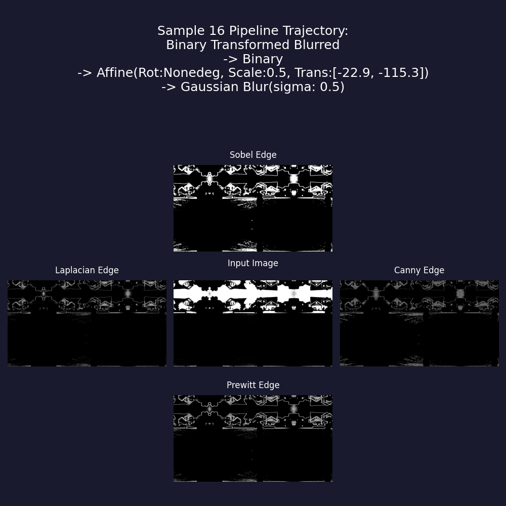
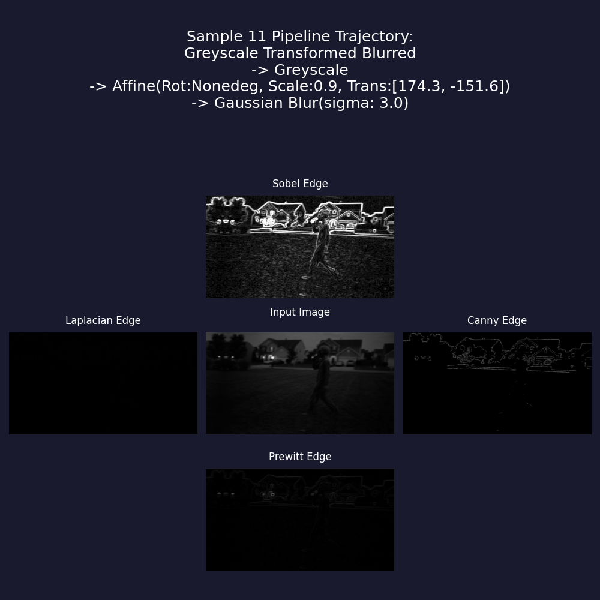
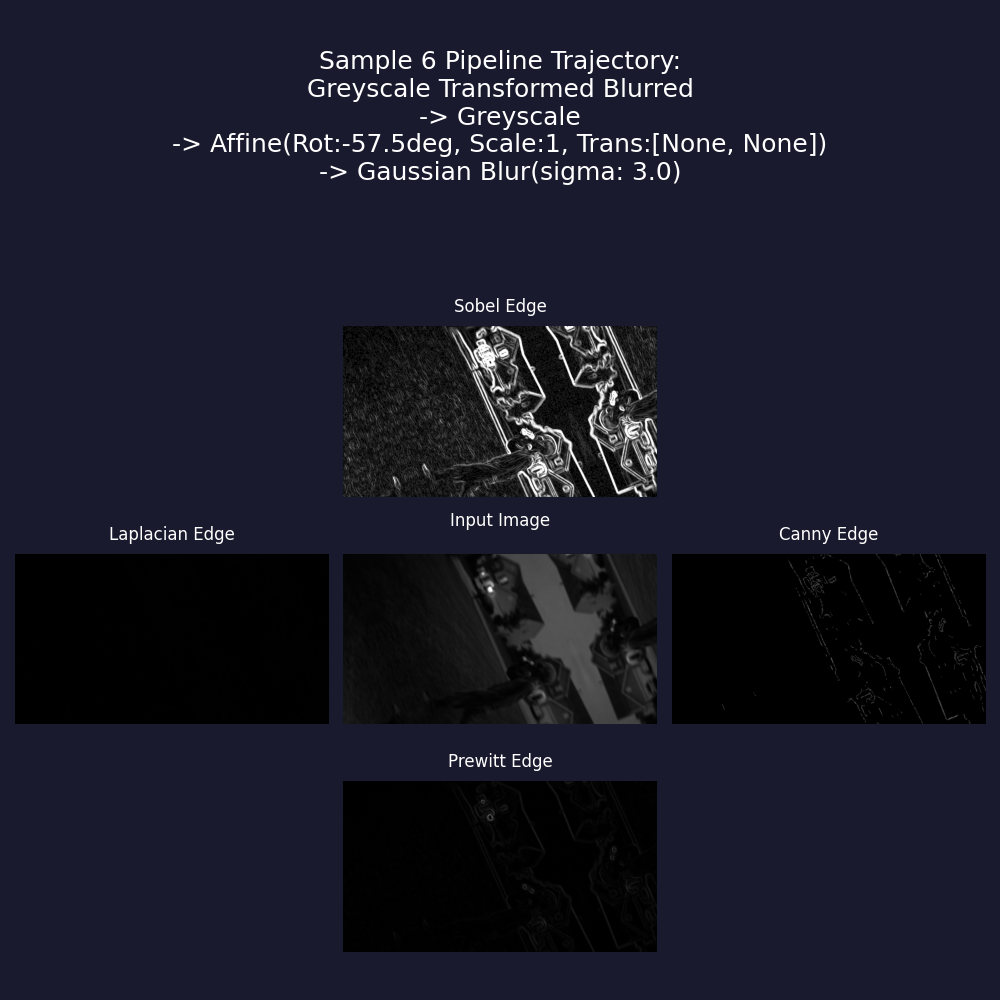
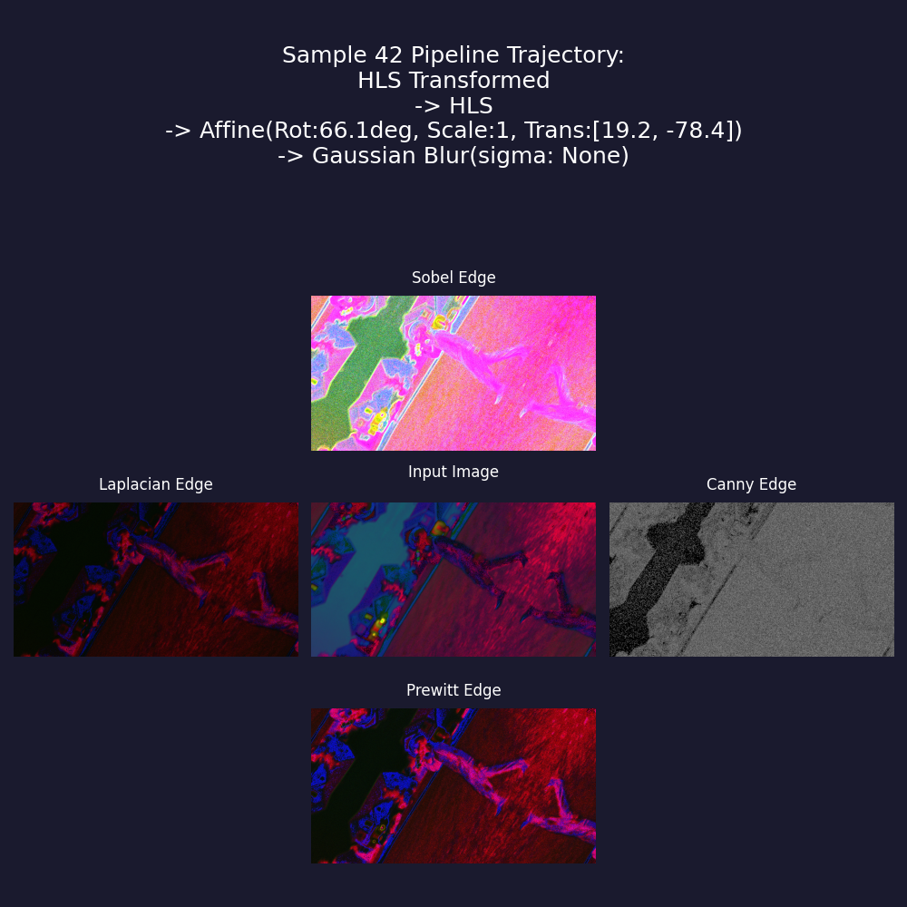
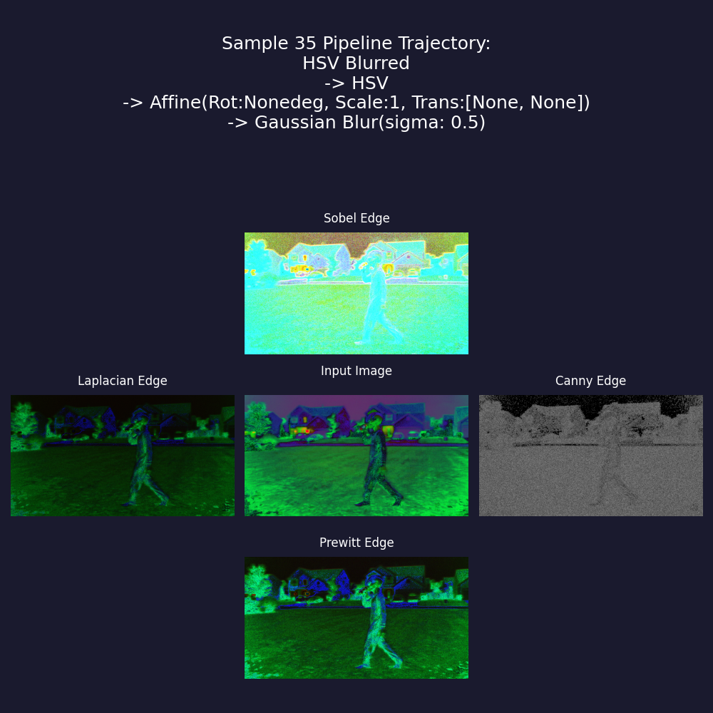
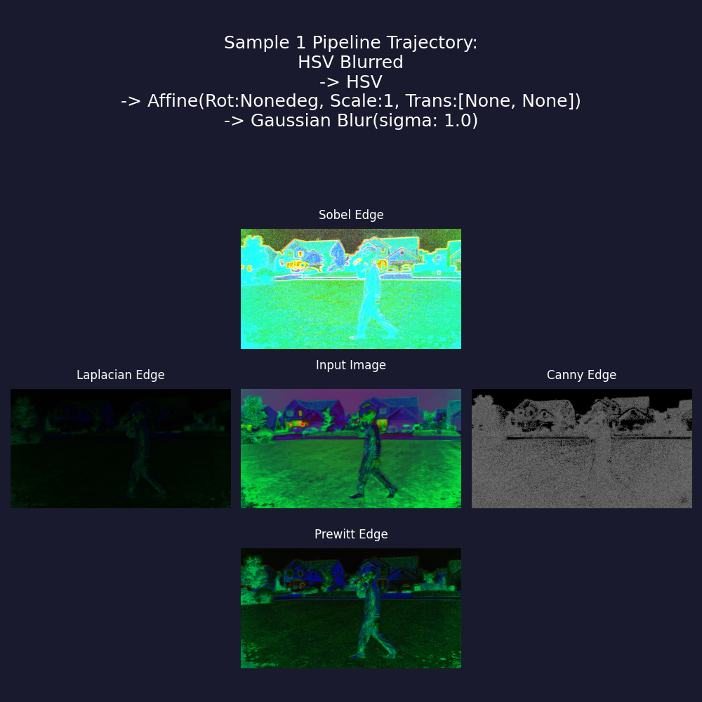

# JenniferIsobe-CS898BA-Project1

## Table of Contents

- [JenniferIsobe-CS898BA-Project1](#jenniferisobe-cs898ba-project1)
  - [Table of Contents](#table-of-contents)
  - [Homework 1](#homework-1)
    - [Code Explanation](#code-explanation)
      - [Dependencies](#dependencies)
      - [Configuration \& Setup](#configuration--setup)
      - [Helper Functions](#helper-functions)
        - [`file_hash(path)`](#file_hashpath)
        - [`write_file(path, img)`](#write_filepath-img)
        - [`count_files(path)`](#count_filespath)
        - [`to_rgb_display(img)`](#to_rgb_displayimg)
      - [Part 2: Basic Analysis](#part-2-basic-analysis)
        - [Step 1: Per-Channel Statistics](#step-1-per-channel-statistics)
        - [Step 2: Color Space Conversions](#step-2-color-space-conversions)
        - [Step 3 \& 4: HSV Normalization](#step-3--4-hsv-normalization)
        - [Step 6: Affine Transformations](#step-6-affine-transformations)
        - [Step 8: Gaussian Blur](#step-8-gaussian-blur)
      - [Part 3: Edge Detection](#part-3-edge-detection)
        - [Step 1 \& 2: Image Subsets](#step-1--2-image-subsets)
        - [Step 4: Edge Detection Techniques](#step-4-edge-detection-techniques)
        - [Step 7: Comparison Plots](#step-7-comparison-plots)
    - [Running the program](#running-the-program)
    - [2.8 Gaussian Blur discussion](#28-gaussian-blur-discussion)
    - [3.5 Edge Detection discussion](#35-edge-detection-discussion)
    - [Plots](#plots)
      - [Plot 1](#plot-1)
      - [Plot 2](#plot-2)
      - [Plot 3](#plot-3)
      - [Plot 4](#plot-4)
      - [Plot 5](#plot-5)
      - [Plot 6](#plot-6)
  - [Homework 2](#homework-2)
    - [HW2 Code Explanation](#hw2-code-explanation)
      - [HW2 Dependencies](#hw2-dependencies)
      - [HW2 Setup and Configuration](#hw2-setup-and-configuration)
      - [Part 2](#part-2)
      - [Part 3](#part-3)
      - [Part 4](#part-4)
      - [Running the HW2](#running-the-hw2)
    - [Qualitative Analysis](#qualitative-analysis)
    - [Quantitative Comparison](#quantitative-comparison)
    - [HW2 Plot](#hw2-plot)

This repository was completed as part of CS898BA and serves as an introduction to image analysis and processing using Python and OpenCV.

The AI_LOG directory provides a history of interactions with AI that were used as part of the development of this repo.

Files contained in the result_analysis directory are the files that were used for the discussions below. This directory contains subdirectories for parts 2 and 3 with part 3 contain additional subdirectories for the plots.

script.py contains the logic for the image analysis of the given original.png file. (***Please note, this will not work if original.png is not in the project root***)

## Homework 1

### Code Explanation

#### Dependencies

```python
import numpy as np # Array operations and additional computation
import cv2 as cv # OpenCV — image read and write, processing, edge detection
from pathlib import Path # Cross-platform file path handling
import hashlib  # MD5 hashing for cache invalidation
from scipy import stats # Skewness calculation for channel statistics
import random # Reproducible random transforms and subset selection
import matplotlib.pyplot as plt  # Generating comparison plot figures
```

#### Configuration & Setup

```python
SEED = 42
random.seed(SEED)
```

The fixed random seed ensures that every run produces the same results for reproducibility. Change `SEED` to any other integer to get a different random outcome while keeping it reproducible.

```python
RESULTS_DIR = CURRENT_DIR / "results"
PART2_DIR   = RESULTS_DIR / "part2"
PART3_DIR   = RESULTS_DIR / "part3"
PLOTS_DIR   = PART3_DIR / "plots"
README_PLOTS_DIR = PART3_DIR / "readme_plots"
CACHE_DIR   = CURRENT_DIR / ".cache"
```

All output directories are defined as `Path` objects and created with `mkdir(exist_ok=True)`, which means the script can be rerun without manually clearing folders beforehand.

#### Helper Functions

##### `file_hash(path)`

```python
def file_hash(path):
    with open(path, "rb") as file:
        return hashlib.md5(file.read()).hexdigest()
```

Generates an MD5 hash of a file which is used to build cache filenames.

##### `write_file(path, img)`

```python
def write_file(path, img):
    cv.imwrite(path, img)
```

A thin wrapper around `cv.imwrite` that keeps the save calls consitent and simple throughout the script.

##### `count_files(path)`

```python
def count_files(path):
    file_count = sum(1 for item in path.iterdir() if item.is_file())
    print(f'Total files in {path.name}: {file_count}')
```

Counts only files (not subdirectories) in a given directory and prints the total.

##### `to_rgb_display(img)`

```python
def to_rgb_display(img):
    if len(img.shape) == 2:
        return cv.cvtColor(img, cv.COLOR_GRAY2RGB)
    return cv.cvtColor(img, cv.COLOR_BGR2RGB)
```

Converts images to a RGB array safe for `matplotlib.imshow`.

OpenCV stores color images in BGR order, which matplotlib does not expect, so the channels must be swapped before display. Single-channel images (greyscale, binary, Canny output, Prewitt output) are translated to 3-channel by duplicating the single channel across R, G, and B. This doesn't change the overall image but prevents errors.

#### Part 2: Basic Analysis

##### Step 1: Per-Channel Statistics

```python
b, g, r = cv.split(img)

for name, channel in {"Blue": b, "Red": r, "Green": g}.items():
    flattened = channel.flatten()
    histogram = np.bincount(flattened, minlength=256)
    mode = np.argmax(histogram)
```

`cv.split` separates the BGR image into one array per channel. Each channel is flattened to a 1D array so that NumPy and SciPy statistical functions can operate across all pixels at once.

Mode is computed manually using `np.bincount`, which counts the occurrences of each integer value 0-255 and returns the intensity with the highest count. This is faster and more reliable than `scipy.stats.mode` for integer pixel data.

The channel data is cached after the first run:

```python
bgr_channels_cache = CACHE_DIR / f'bgr_channel_cache_{file_hash(IMG_NAME)}.npz'

if bgr_channels_cache.is_file():
    channels = np.load(bgr_channels_cache)
    b, g, r = channels["b"], channels["g"], channels["r"]
else:
    b, g, r = cv.split(img)
    np.savez(bgr_channels_cache, b=b, g=g, r=r)
```

The cache filename includes the MD5 hash of the source image, so it automatically invalidates if the source file is replaced.

##### Step 2: Color Space Conversions

Seven images are produced and added to the `all_images` dictionary, which tracks each image alongside some metadata (color space, transform parameters, sigma) that will be used for the plots:

| Key | Conversion | OpenCV flag |
| --- | --- | --- |
| `original` | None (BGR as-is) | — |
| `grey` | BGR -> Greyscale | `COLOR_BGR2GRAY` |
| `bin` | Greyscale -> Binary | `THRESH_BINARY + THRESH_OTSU` |
| `hsv` | BGR -> HSV | `COLOR_BGR2HSV` |
| `cielab` | BGR -> CIELab | `COLOR_BGR2Lab` |
| `hls` | BGR -> HLS | `COLOR_BGR2HLS` |
| `norm_rgb` | HSV (equalized) -> BGR | `COLOR_HSV2BGR` |

Binary thresholding uses Otsu's method, which automatically determines the best threshold value:

```python
threshold_val, bin_img = cv.threshold(grey_img, 0, 255, cv.THRESH_BINARY + cv.THRESH_OTSU)
```

##### Step 3 & 4: HSV Normalization

```python
h, s, v = cv.split(hsv_img)
norm_hsv = cv.merge([h, s, cv.equalizeHist(v)])
norm_brg = cv.cvtColor(norm_hsv, cv.COLOR_HSV2BGR)
```

Histogram equalization brightens the image by adjusting pixel intensities so that the full 0-255
range is used. The brightness is controled without disturbing the hue or saturation by choosing to only apply the equalization of the V channel. The result is converted to BGR for saving and further processing.

##### Step 6: Affine Transformations

Each of the 7 base images receives 2 random affine transforms, producing 14 additional images. Each transform randomly activates any combination of four operations:

```python
do_rotate    = bool(random.getrandbits(1))
do_scale     = bool(random.getrandbits(1))
do_shear     = bool(random.getrandbits(1))
do_translate = bool(random.getrandbits(1))
```

If none are activated, one is forced via `random.randint(0, 3)`.

**Rotation and scaling** are applied together via OpenCV's rotation matrix:

```python
M = cv.getRotationMatrix2D(center, angle, scale)
```

This produces a 2x3 affine matrix combining rotation (up to +/-180°) and
scaling (0.5-1.2x) around the image center.

**Translation** is applied by adding offsets directly to the matrix:

```python
M[0, 2] += tx # horizontal shift
M[1, 2] += ty # vertical shift
```

**Shear** is applied by multiplying the existing matrix with a shear matrix:

```python
def apply_shear(M, shear_x, shear_y):
    shear_matrix = np.array([[1, shear_x, 0],
                              [shear_y, 1,  0],
                              [0,       0,  1]], dtype=np.float64)
    M_3x3 = np.vstack([M, [0, 0, 1]])
    return (shear_matrix @ M_3x3)[:2]
```

The existing 2x3 matrix is temporarily expanded to 3x3 for matrix multiplication, then collapsed back. `shear_x` skews columns horizontally and `shear_y` skews rows vertically.

All transforms use `BORDER_REFLECT` to fill areas that fall outside the frame after transformation. `BORDER_CONSTANT` can be used to create cutoff at these points and fill the areas with black.

##### Step 8: Gaussian Blur

```python
sigmas = (0.5, 1.0, 1.5, 2.0, 2.5, 3.0, 3.5)

for sigma in sigmas:
    kernel_size = int(6 * sigma + 1)
    kernel_size = kernel_size if kernel_size % 2 == 1 else kernel_size + 1
    blur = cv.GaussianBlur(image, (kernel_size, kernel_size), sigma)
```

Each of the 21 images is blurred at all 7 sigma levels, giving 147 blurred images.

The kernel size scales with sigma. OpenCV requires the kernel size to be an odd integer, so the result is incremented by 1 if it is even.

| Sigma | Kernel size |
| --- | --- |
| 0.5 | 5x5 |
| 1.0 | 7x7 |
| 1.5 | 11x11 |
| 2.0 | 13x13 |
| 2.5 | 17x17 |
| 3.0 | 19x19 |
| 3.5 | 23x23 |

#### Part 3: Edge Detection

##### Step 1 & 2: Image Subsets

```python
all_image_names = list(all_images.keys())
random.shuffle(all_image_names)

group1 = all_image_names[:42]
group2 = all_image_names[42:84]
group3 = all_image_names[84:126]
group4 = all_image_names[126:]

group_num      = random.randint(0, 3)
selected_group = groups[group_num]
```

The entire 168 image key pool is shuffled and split into four equal subsets of 42. One subset is chosen randomly for edge detection. With `SEED = 42`, the same group is always selected — change the seed to investigate other subsets.

##### Step 4: Edge Detection Techniques

All four detectors are applied to every image in the chosen 42-image subset. `CV_64F` output allows negative values then `convertScaleAbs` folds them to absolute values and scales to uint8. This is done for saving the images to their directories.

**Laplacian**

```python
laplacian_edges = cv.Laplacian(edge_image, cv.CV_64F)
laplacian_abs   = cv.convertScaleAbs(laplacian_edges)
```

A second-order derivative operator that detects edges in all directions at once.

**Sobel**

```python
sobelx_edges        = cv.Sobel(edge_image, cv.CV_64F, 1, 0, ksize=5)
sobely_edges        = cv.Sobel(edge_image, cv.CV_64F, 0, 1, ksize=5)
combined_sobel_edges = cv.magnitude(sobelx_edges, sobely_edges)
sobel_abs           = cv.convertScaleAbs(combined_sobel_edges)
```

Computes gradients separately in the X and Y directions, then combines them giving the overall edge detection results.

**Canny (auto-threshold)**

```python
def auto_canny(image, sigma=0.33):
    median = np.median(image)
    lower  = int(max(0,   (1.0 - sigma) * median))
    upper  = int(min(255, (1.0 + sigma) * median))
    return cv.Canny(image, lower, upper)

canny_input = cv.convertScaleAbs(edge_image) if edge_image.dtype != np.uint8 else edge_image
canny_edges = auto_canny(canny_input)
```

In order to try to produce better edge detection results, the canny thresholds are calculated automatically rather than hardcoded. The hope is that this gives better results across a range of images in different color spaces and with various blurring.

**Prewitt**

```python
prewitt_kernel_x = np.array([[-1, 0, 1],[-1, 0, 1],[-1, 0, 1]], dtype=np.float32)
prewitt_kernel_y = np.array([[-1,-1,-1],[ 0, 0, 0],[ 1, 1, 1]], dtype=np.float32)

prewitt_edges_x = cv.filter2D(edge_image, cv.CV_64F, prewitt_kernel_x)
prewitt_edges_y = cv.filter2D(edge_image, cv.CV_64F, prewitt_kernel_y)
prewitt_edges   = cv.magnitude(prewitt_edges_x, prewitt_edges_y)
prewitt_abs     = cv.convertScaleAbs(prewitt_edges)
```

OpenCV has no built-in Prewitt function, so the kernels are defined manually and applied with `filter2D`.

##### Step 7: Comparison Plots

```python
fig = plt.figure(figsize=(10, 10))
gs  = fig.add_gridspec(3, 3)

ax_top    = fig.add_subplot(gs[0, 1]) # Sobel    — top center
ax_left   = fig.add_subplot(gs[1, 0]) # Laplacian — middle left
ax_center = fig.add_subplot(gs[1, 1]) # Input    — center
ax_right  = fig.add_subplot(gs[1, 2]) # Canny    — middle right
ax_bottom = fig.add_subplot(gs[2, 1]) # Prewitt  — bottom center
```

Each plot arranges the input image at the center of a 3x3 grid with the four edge detection results surrounding it in a cross pattern.

The figure title gives stats centered at the top of the plot:

```python
fig.suptitle(
    f'Sample {sample_number} Pipeline Trajectory:\n'
    f'{image_dict["name"]}\n'
    f'-> {image_dict["space"]}\n'
    f'-> Affine(Rot:{image_dict["angle"]}deg, Scale:{image_dict["scale"]}, '
    f'Trans:[{image_dict["tx"]}, {image_dict["ty"]}])\n'
    f'-> Gaussian Blur(sigma: {image_dict["sigma"]})\n'
)
```

Six plots are randomly selected and saved to `readme_plots/` for inclusion in this README:

```python
readme_plots = random.sample(range(1, 43), 6)

if sample_number in readme_plots:
    plt.savefig(README_PLOTS_DIR / f"{img_name}_comparison.png")
```

### Running the program

Open a terminal and clone to repository to your local machine: `git clone https://github.com/Jisobe/JenniferIsobe-CS898BA-Project1.git`

Change directories into the project: `cd JenniferIsobe-CS898BA-Project1`

Run the following in the terminal to run the script: `uv run script.py`

Run the following in the terminal to run the script and write the terminal output to a file: `uv run script.py > output.txt`

***Note: Re-running the program will override the files in the results directory. If you want to save those files, rename the results directory***

### 2.8 Gaussian Blur discussion

On some of the images, like the original and cielab it is a bit difficult to determine the effect of the blur on the image visually. The original is pretty uniformly dark and and cielab is uniformly yellowish so the blurring effect does not stand out as much until the sigma values are at the highest levels. The greyscale image is also difficult to see the effect on but is more apparent than the original and cielab. The HSV and binary images are the easiest for me to see a difference in the sigma levels. Overall, the sigma level that give the best edge definition seems to be between levels 1.5 and 2.0.

Sigma 0.5: This has very little effect on the blurring and noise reduction when compared to the pre blurred image. Across all of the images, it is almost impossible to see a difference between the blurred image and the original.
Sigma 1.0: Provides a slightly more blurred image but still has very little effect. In the middle area of the grass the graininess is smoothed some but a lot of the graininess overall is still present.
Sigma 1.5: This is where the noise reduction becomes more noticeable, for most of the images. The noise of images are reduced but it is not overly blurred where the edges are lost. The grass area becomes even more smooth and the house graininess becomes much smoother. On the binary image I think this is the best sigma level for the edges. At 2.0 the edges on the house start to become a little over blurred.
Sigma 2.0: This sigma level also has a very good balance between noise reduction and edge clarity retention. There is not a large difference between this an 1.5 but does have a little bit more smoothing. For the HSV image, this level seems to be the best for the edge detection.
Sigma 2.5: At this point, the images start to become more blurry than clear, reducing the usefulness of the blurring. At this level and above, the binary image has a much less noticeable change as the levels change.
Sigma 3.0: The images' edges are very softened at this level and while I don't think edge detection would be impossible, it would be more difficult. This level is pretty similar to 2.5.
Sigma 3.5: At this sigma level, all of the images become overly blurry resulting in the loss of edges on the image.

So a large sigma value will make the blurring effect on the image more intense.

### 3.5 Edge Detection discussion

Sobel does well with edge detection for the given dark original image and altered color spaces. For the most part each of the images has edges that are distinct and bright. The calculation requires both x and y directional readings that are then combined back to give the overall image allowing for better detection. The downside to this is that the edges are often very thick so they are not as crisp as some of the other methods. The brightness can also make it so the edges kind of blur together rather than being distinct. In some of the images, it seemed to over detect producing a very bright image with little definition. To me, Sobel seems to have much less of a trend when it comes to examining the effect of the blur. Some images produce good edges with a sigma value of 1.0 or 2.0 but the same values in a different color space give images with almost no edges.

Prewitt is similar to Sobel, requiring filtering in the x and y directions that are then combined to create a single output giving it a similar benefit. However, it does not have the same blurring Sobel does so it is more sensitive to noise in images. Prewitt is similar to Sobel when it comes to sigma values. It seems to matter what the color space is when looking at how the sigma effects the edge definition. Again like Sobel, edges on most of the images are thicker rather than being very precise.

Canny has the benefit of reducing high-frequency variations through filtering meaning it is not as affected by noise. For images where Canny edge detection works, the lines it produces are very clear and thin, making it very precise. The filtering it does however, means that some of the finer details may be lost. Canny image detection did really well on the images where edges were shown. On those few images, the edges are very clean and clear on the houses. Canny seems to do the best with the binary images that have a high sigma value used for the blur. Low sigma values give much grainier images after using Canny edge detection.

Laplacian's benefit is that is able to find edges in every directions without having to explicitly break the filtering down in to x and y directions. Being a second order derivative detector makes it better at finding the finer details in images. This sensitivity to finding finer details also makes it more sensitive to excess noise. This is likely why most of the Laplacian images in the result where extremely dark. This sensitivity however means it would likely be good for images with low noise levels.

| Image Color Space Family | Prewitt | Sobel | Laplacian | Canny | Best Overall |
| --- | --- | --- | --- | --- | --- |
| Original (RGB) | Shows faint edges of the house | Shows bright edges especially around the houses | Basically black | Mostly black with either faint edges shown or very noisy images | Sobel |
| Normalized RGB | Dark image with light edges that are decently defined | Very bright images with unclear edges | Either very dark or light image with not clear edge detection | Dark image with figures show through what looks like white noise with no or sparce edges | Prewitt |
| HSV | Dark image with edges outlined will in green | Very bright image that makes much of the middle and lower sections indistinguishable | Basically black | Dark image with figures shown through clumps of light dots but edges are not very well defined | Prewitt |
| HLS | Faint outlines on a dark image or an overall pink/purple image that is hard to see the figures | Dark image with bright edges on the figures | Overall very dark with figures difficult or impossible to distinguish | Dark image with clumps of light dots showing figures. This seems to show more of the actual figures than just the edges | Sobel |
| Greyscale | Very dark images with some faint outlines | Dark image with bright edges | Very dark with no real edge distinction | Very dark with some edges shown. The unblurred greyscale images shows the most detail and gives a much brighter result. | Sobel |
| CIELab | Very dark images with some faint outlines | Dark image with bright, purply edges | Very dark with no real edge distinction | Very dark with no real edge distinction | Sobel |
| Binary | Very crisp thin edge lines on a dark image | Edge lines are present but are blurry | Edges are shown on most versions but are often grainy | Edges are shown but are often grainy execpt when the sigma value for the blur was at 3 which gave clear clean lines | Prewitt |

For all of the transformation variations of the original, CIELab, and greyscale images, Sobel edge detection gives the best edge definition while the other techniques result in extremely dark, almost black images. Across all of the images, Sobel is the best for the edge detection with Prewitt also performing well but not quite as well overall. I would say Laplacian is the worst. It and Canny both produce very little edge detection but across all of the color spaces, Laplacian creates very dark or black images with no indication of edges.

### Plots

#### Plot 1



#### Plot 2



#### Plot 3



#### Plot 4



#### Plot 5



#### Plot 6



## Homework 2

### HW2 Code Explanation

#### HW2 Dependencies

#### HW2 Setup and Configuration

#### Part 2

#### Part 3

#### Part 4

#### Running the HW2

### Qualitative Analysis

### Quantitative Comparison

### HW2 Plot
