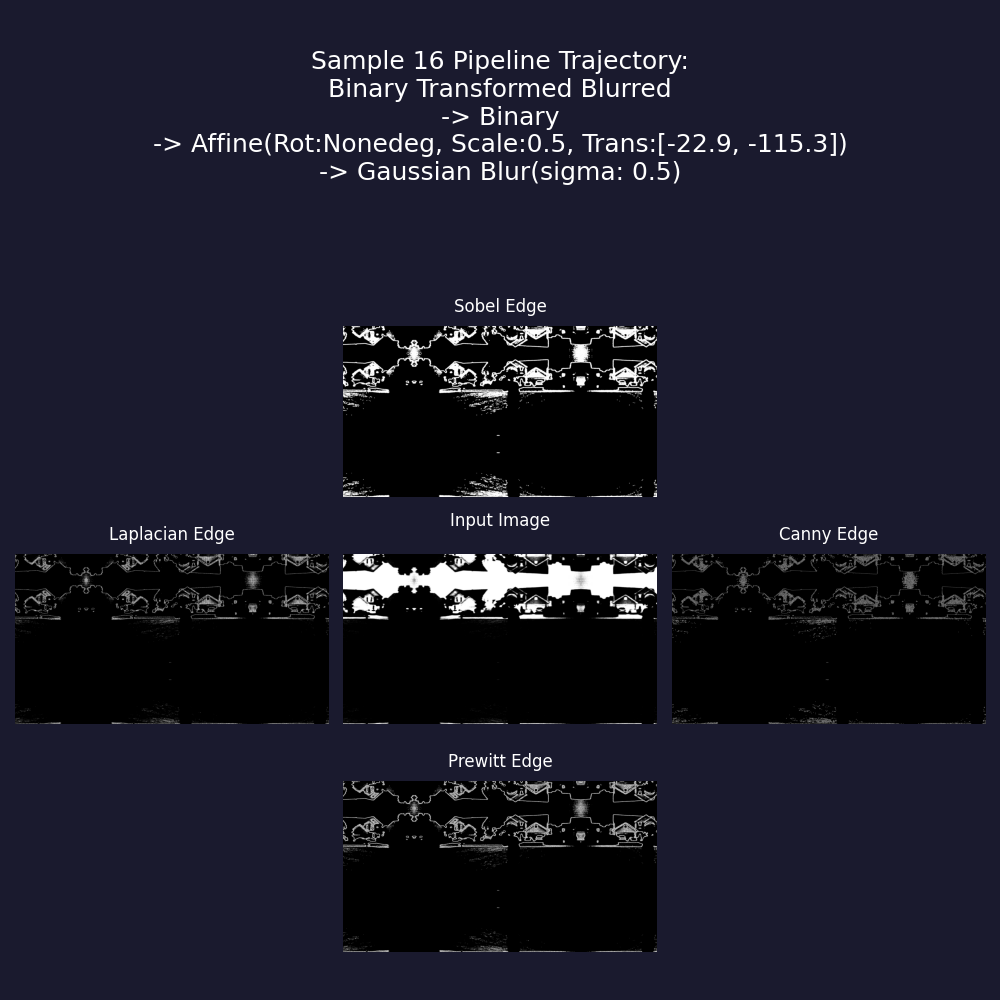
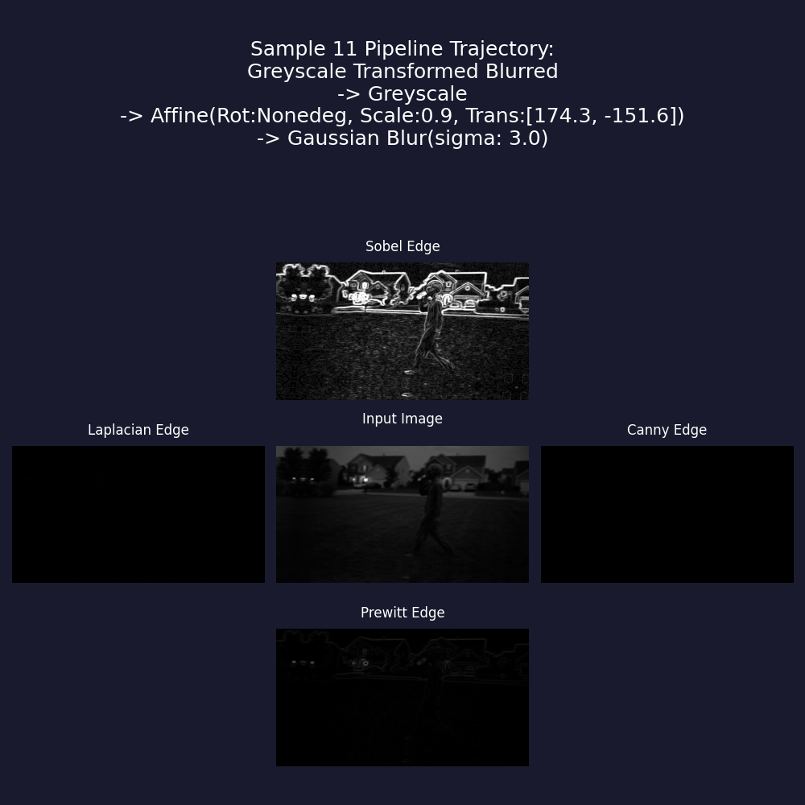
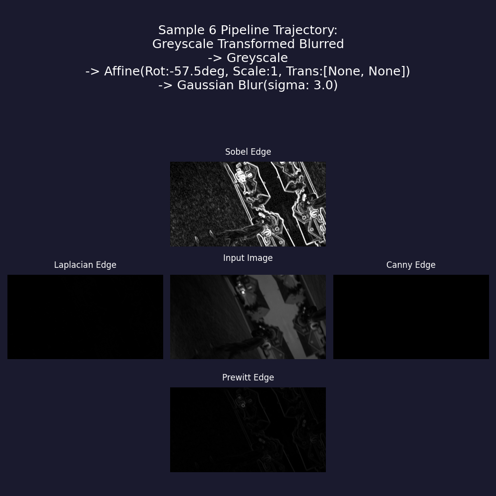
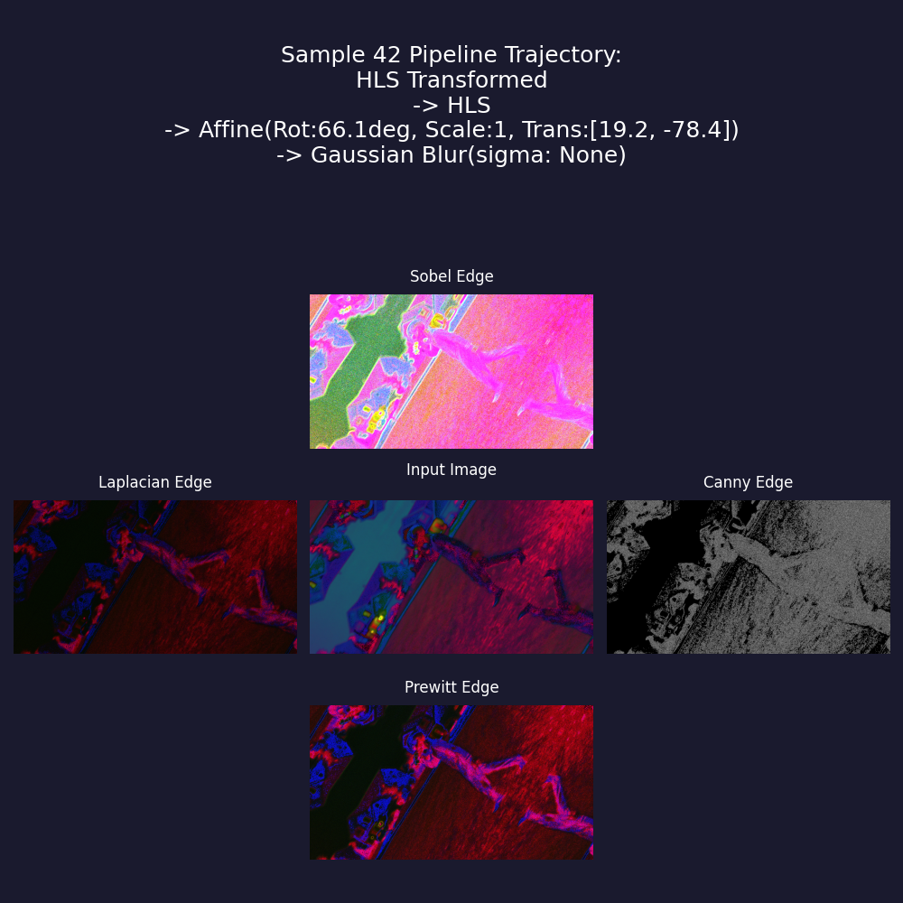
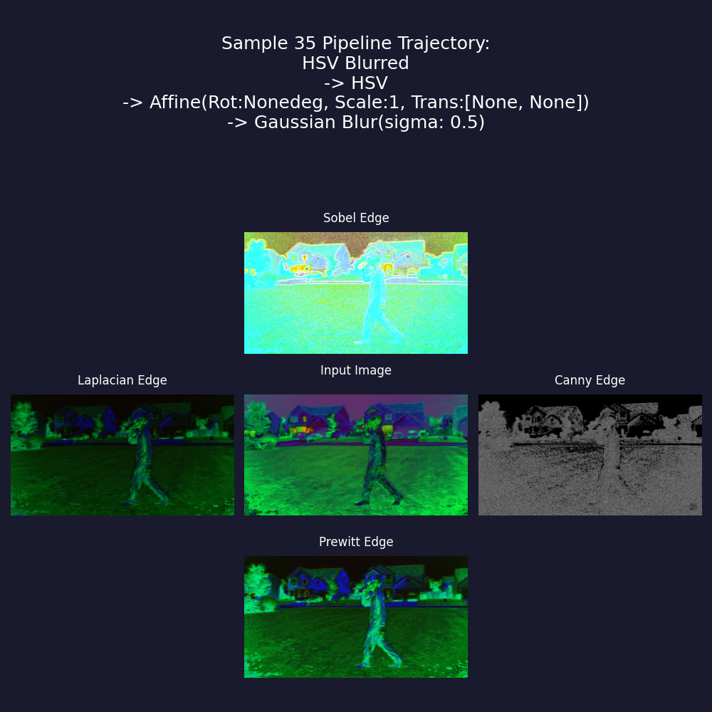
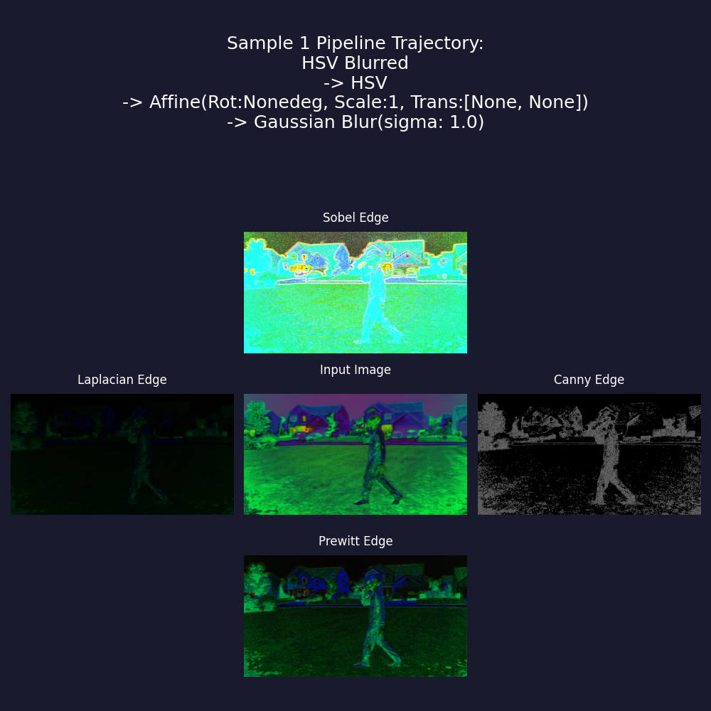

# JenniferIsobe-CS898BA-Project1

This repository was completed as part of CS898BA and serves as an introduction to image analysis and processing using Python and OpenCV.

The AI_LOG directory provides a history of interactions with AI that were used as part of the development of this repo.

Files contained in the result_analysis directory are the files that were used for the discussions below.

## Running the program

Open a terminal and clone to repository to your local machine: `git clone https://github.com/Jisobe/JenniferIsobe-CS898BA-Project1.git`

Change directories into the project: `cd JenniferIsobe-CS898BA-Project1`

Run the following in the terminal to run the script: `uv run script.py`

Run the following in the terminal to run the script and write the terminal output to a file: `uv run script.py > output.txt`

***Note: Re-running the program will override the files in the results directory. If you want to save those files, rename the results directory***

## 2.8 Gaussian Blur discussion

On some of the images, like the original and cielab it is a bit difficult to determine the effect of the blur on the image visually. The original is pretty uniformly dark and and cielab is uniformly yellowish so the blurring effect does not stand out as much until the sigma values are at the highest levels. The greyscale image is also difficult to see the effect on but is more apparent than the original and cielab. The HSV and binary images are the easiest for me to see a difference in the sigma levels. Overall, the sigma level that give the best edge definition seems to be between levels 1.5 and 2.0.

Sigma 0.5: This has very little effect on the blurring and noise reduction when compared to the pre blurred image. Across all of the images, it is almost impossible to see a difference between the blurred image and the original.
Sigma 1.0: Provides a slightly more blurred image but still has very little effect. In the middle area of the grass the graininess is smoothed some but a lot of the graininess overall is still present.
Sigma 1.5: This is where the noise reduction becomes more noticeable, for most of the images. The noise of images are reduced but it is not overly blurred where the edges are lost. The grass area becomes even more smooth and the house graininess becomes much smoother. On the binary image I think this is the best sigma level for the edges. At 2.0 the edges on the house start to become a little over blurred.
Sigma 2.0: This sigma level also has a very good balance between noise reduction and edge clarity retention. There is not a large difference between this an 1.5 but does have a little bit more smoothing. For the HSV image, this level seems to be the best for the edge detection.
Sigma 2.5: At this point, the images start to become more blurry than clear, reducing the usefulness of the blurring. At this level and above, the binary image has a much less noticeable change as the levels change.
Sigma 3.0: The images' edges are very softened at this level and while I don't think edge detection would be impossible, it would be more difficult. This level is pretty similar to 2.5.
Sigma 3.5: At this sigma level, all of the images become overly blurry resulting in the loss of edges on the image.

So a large sigma value will make the blurring effect on the image more intense.

## 3.5 Edge Detection discussion

TODO: Add 3.5 discussion to README: Discuss the pros and cons of each edge detection technique and perform an analysis of which of these techniques works best for this image set. Reminder – Canny may be the most used and applied, but it may not be the best in your case. Make sure your analysis fits your results

Sobel does well with edge detection for the given dark original image and altered color spaces. For the most part each of the images has edges that are distinct and bright. The calculation requires both x and y directional readings that are then combined back to give the overall image allowing for better detection. The downside to this is that the edges are often very thick so they are not as crisp as some of the other methods. The brightness can also make it so the edges kind of blur together rather than being distinct. In some of the images, it seemed to over detect producing a very bright image with little definition. To me, Sobel seems to have much less of a trend when it comes to examining the effect of the blur. Some images produce good edges with a sigma value of 1.0 or 2.0 but the same values in a different color space give images with almost no edges.

Prewitt is similar to Sobel, requiring filtering in the x and y directions that are then combined to create a single output giving it a similar benefit. However, it does not have the same blurring Sobel does so it is more sensitive to noise in images. Prewitt is similar to Sobel when it comes to sigma values. It seems to matter what the color space is when looking at how the sigma effects the edge definition. Again like Sobel, edges on most of the images are thicker rather than being very precise.

Canny has the benefit of reducing high-frequency variations through filtering meaning it is not as affected by noise. For images where Canny edge detection works, the lines it produces are very clear and thin, making it very precise. The filtering it does however, means that some of the finer details may be lost. Canny image detection did really well on the images where edges were shown. On those few images, the edges are very clean and clear on the houses. Canny seems to do the best with the binary images that have a high sigma value used for the blur. Low sigma values give much grainier images after using Canny edge detection.

Laplacian's benefit is that is able to find edges in every directions without having to explicitly break the filtering down in to x and y directions. Being a second order derivative detector makes it better at finding the finer details in images. This sensitivity to finding finer details also makes it more sensitive to excess noise. This is likely why most of the Laplacian images in the result where extremely dark. This sensitivity however means it would likely be good for images with low noise levels.

| Image Color Space Family | Prewitt | Sobel | Laplacian | Canny | Best Overall |
| --- | --- | --- | --- | --- | --- |
| Original (RGB) | Shows faint edges of the house | Shows bright edges especially around the houses | Basically black | Mostly black with either faint edges shown or very noisy images | Sobel |
| Normalized RGB | Dark image with light edges that are decently defined | Very bright images with unclear edges | Either very dark or light image with not clear edge detection | Dark image with figures show through what looks like white noise with no or sparce edges | Prewitt |
| HSV | Dark image with edges outlined will in green | Very bright image that makes much of the middle and lower sections indistinguishable | Basically black | Dark image with figures shown through clumps of light dots but edges are not very well defined | Prewitt |
| HLS | Faint outlines on a dark image or an overall pink/purple image that is hard to see the figures | Dark image with bright edges on the figures | Overall very dark with figures difficult or impossible to distinguish | Dark image with clumps of light dots showing figures. This seems to show more of the actual figures than just the edges | Sobel |
| Greyscale | Very dark images with some faint outlines | Dark image with bright edges | Very dark with no real edge distinction | Very dark with some edges shown. The unblurred greyscale images shows the most detail and gives a much brighter result. | Sobel |
| CIELab | Very dark images with some faint outlines | Dark image with bright, purply edges | Very dark with no real edge distinction | Very dark with no real edge distinction | Sobel |
| Binary | Very crisp thin edge lines on a dark image | Edge lines are present but are blurry | Edges are shown on most versions but are often grainy | Edges are shown but are often grainy execpt when the sigma value for the blur was at 3 which gave clear clean lines | Prewitt |

For all of the transformation variations of the original, CIELab, and greyscale images, Sobel edge detection gives the best edge definition while the other techniques result in extremely dark, almost black images. Across all of the images, Sobel is the best for the edge detection with Prewitt also performing well but not quite as well overall. I would say Laplacian is the worst. It and Canny both produce very little edge detection but across all of the color spaces, Laplacian creates very dark or black images with no indication of edges.

## Plots

### Plot 1

### Plot 2

### Plot 3

### Plot 4

### Plot 5

### Plot 6

